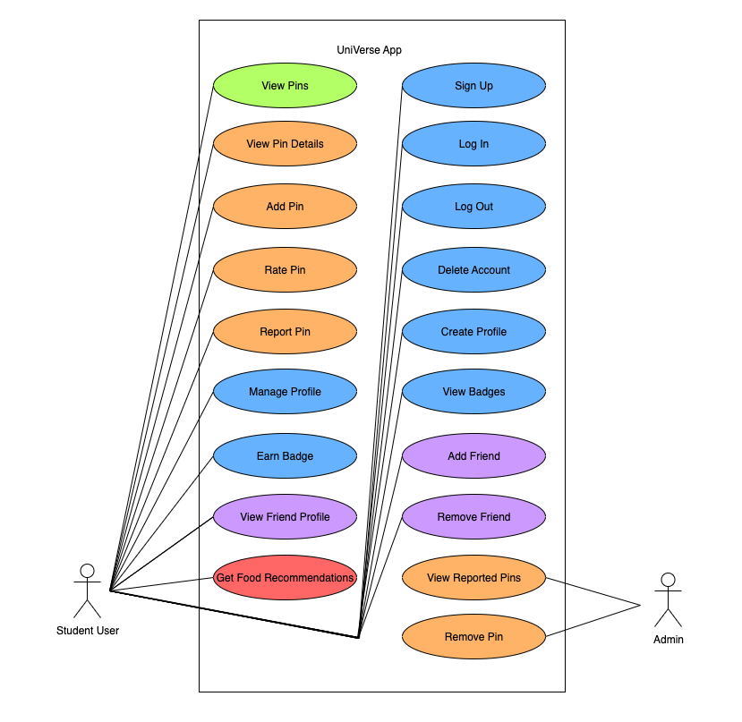
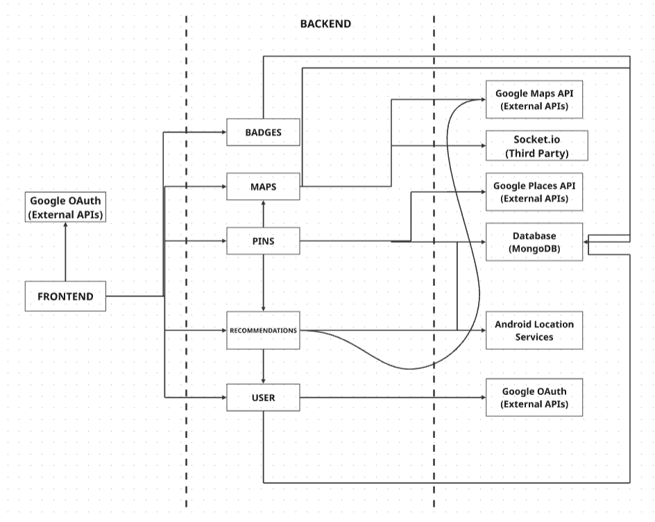

# Requirements and Design

## 1. Change History

| **Change Date**   | **Modified Sections** | **Rationale** |
| ----------------- | --------------------- | ------------- |
| _Nothing to show_ |

---

## 2. Project Description

**UniVerse** is a mobile-first application designed for university students to navigate campus life more effectively. The app provides a map of campus locations, including study spaces, libraries, and food spots, along with community-created pins for events, chill areas, and student-reported updates.  

Students can also connect with friends, earn badges for their activities, and receive personalized recommendations for nearby pins/locations based on relevant criteria (e.g., food recommendations given the time of day). The app creates a lightweight social ecosystem for students by combining location-based data, gamification, and personalization.  

Target audience: university students who want an easy way to discover study spots, food options, and campus events, while staying connected with friends.  

---

## 3. Requirements Specification

### **3.1. List of Features**
- **Authentication**: Google OAuth login.  
- **View Map**: Display pre-seeded pins, user-created pins, and later, friend locations.  
- **Manage Pins**: Create, update, and delete community pins (study spaces, events, chill areas, shops).  
- **Manage Account**: Create, update, or delete an account, view profile attributes, e.g, badges and friends.  
- **Manage Friends**: Send friend requests, maintain a friends list, and view friend profiles.  
- **Recommend Locations**: Suggest location/pins based on user preferences, time of day, etc.

---

### **3.2. Use Case Diagram**

---

### **3.3. Actors Description**
1. **Student User**: A student using the app to find study spots, food, events, and to connect with friends.  
2. **Admin**: Admins to review reports of unsafe content/pins and remove them.  
---

### **3.4. Use Case Description**
- Use cases for feature 1: **View Map**
  1. **View Pins**: User opens the map to see campus libraries and food spots and pins added by others.  

- Use cases for feature 2: **Manage Pins**
  2. **Add Pin**: User adds a new study space/event pin. 
  3. **View Pin Details**: User clicks a pin to see name, description, and metadata.  
  4. **Report Pin**: User reports a community-created pin as unsafe.  
  5. **Rate Pin**: User gives a pin a thumbs up or thumbs down.  
  6. **View Reported Pins**: Admin can view reported pins.
  7. **Remove Pin**: Admin can remove pins from the map.

- Use cases for feature 3: **Manage Account**
  8. **Sign Up**: User can sign up for the app with their Google account.
  10. **Log In**: User can log in to the app with their Google account after they have signed up.
  11. **Log Out**: User can log out of the app.
  12. **Delete Account**: User can delete their account.
  13. **Create Profile**: User can create a profile for the app.
  14. **Manage Profile**: User can manage their profile for the app.
  15. **Earn Badge**: User receives a profile badge for activity (e.g., daily logins, time at library).  
  16. **View Badges**: User views unlocked profile badges and progress toward new ones.  

- Use cases for feature 4: **Manage Friends**
  17. **Add Friend**: User searches for a classmate by username/email and sends a request.  
  18. **View Friend Profile**: User views a friend’s badges and activity.  
  19. **Remove Friend**: User can remove a friend from their friend network.

- Use cases for feature 5: **Recommend Locations**
  20. **Get Food Recommendations**: App suggests nearby food options at lunch, coffee break, or dinner times.   

---

### **3.5. Formal Use Case Specifications (5 Most Major Use Cases)**

#### Use Case 1: Add Pin
**Description**: A user adds a new pin for a study space, event, or chill spot.  
**Primary actor(s)**: Student User  

**Main success scenario**:
1. User selects the “Add Pin” option.  
2. User enters pin details (name, category, description).  
3. User submits pin.  
4. Pin is saved in the backend and displayed on the map for all users.  

**Failure scenario(s)**:
- 1a. User has no internet connection.  
    - 1a1. The system shows a connectivity error and prompts the user to retry.  
- 3a. User submits incomplete details.  
    - 3a1. System prompts for required missing fields. 

---

#### Use Case 2: View Pin Details
**Description**: A user taps a pin on the map to see its information.  
**Primary actor(s)**: Student User  

**Main success scenario**:
1. User taps the pin on the map.  
2. System fetches pin details from the backend.  
3. Pin details (category, activity level, ratings) are displayed.  

**Failure scenario(s)**:
- 1a. The pin has been deleted, and race conditions/synchronization issues occur.  
    - 1a1. The system shows “pin no longer available.”  
- 2a The user has no active/slow internet connection
    - 2a1. The system shows a connectivity error and asks the user to retry

---

#### Use Case 3: Earn Badge
**Description**: A user earns a badge after fulfilling a requirement.  
**Primary actor(s)**: Student User  

**Main success scenario**:
1. User meets badge condition (e.g., logs in daily for 5 days).  
2. System verifies condition and assigns badge.  
3. User sees badge appear in profile.  

**Failure scenario(s)**:
- 1a. Backend fails to update badge state due to connection issues.  
    - 1a1. The system shows a temporary error and retries later.  

---

#### Use Case 4: Add Friend
**Description**: A student sends a friend request to another student.  
**Primary actor(s)**: Student User  

**Main success scenario**:
1. User searches for another student by username/email.  
2. System matches and shows a potential friend.  
3. User sends request.  
4. Friend accepts, and both are added to each other’s friend lists.  

**Failure scenario(s)**:
- 1a. No matching username found.  
    - 1a1. The system shows “user not found.”  
- 3a. Request fails to send due to connection issues.  
    - 3a1. The system shows an error and retries.  

---

#### Use Case 5: Get Food Recommendations
**Description**: User gets food spot suggestions near their current location.  
**Primary actor(s)**: Student User  

**Main success scenario**:
1. At a certain time (e.g., 1 PM), the app fetches user's location.  
2. Backend queries Google Places API for nearby restaurants.  
3. Backend filters results by “open now.”  
4. Recommendations are displayed to the user.  

**Failure scenario(s)**:
- 1a. User denies location access.  
    - 1a1. The system cannot fetch recommendations.  
- 2a. Google Places API call fails.  
    - 2a1. System shows fallback message: “Unable to fetch recommendations.”  

---

### **3.6. Screen Mock-ups**
(Optional – can be added later if time permits.)

—

### 3.7 Non-Functional Requirements

1. **Performance**  
   The app shall display map pins within **2 seconds** of opening the map and update pins during panning with minimal delay. This ensures a smooth and responsive experience for students navigating campus in real time.  

2. **Scalability**  
   The backend shall support at least **500 concurrent student users** with responses delivered in **≤2 seconds**. This enables the app to handle peak traffic (e.g., during class transitions or at lunchtime) without compromising usability.  

3. **Security**  
   All sensitive student data (friend connections, badges, location history) shall be **encrypted in transit and at rest**. This protects privacy, builds user trust, and aligns with industry security best practices.  

---

## 4. Designs Specification

### **4.1. Main Components**
1. **Authentication Service**
   - **Purpose**: Handles Google OAuth login for all users.  
   - **Rationale**: Using Google OAuth avoids building a custom authentication system and leverages an external trusted identity provider.  

2. **Pin Manager**
   - **Purpose**: Manages CRUD operations for pins (create, update, delete, view).  
   - **Rationale**: Pins are the central content of the app, and isolating them in a component makes it easier to manage validation, reports, and updates.  

3. **Badge Manager**
   - **Purpose**: Assigns badges based on user activity (logins, time spent at locations, reports).  
   - **Rationale**: A separate manager for badges allows us to implement custom logic and computations beyond simple CRUD, supporting gamification.  

4. **Recommendation Engine**
   - **Purpose**: Fetches nearby food spots using Google Places API and applies time-of-day rules.  
   - **Rationale**: Encapsulating recommendation logic separately allows us to combine external API data with custom filters (e.g., lunch vs. dinner).  

---

### **4.2. Databases**

1. **MongoDB**
   - **Purpose**: Stores user data (profiles, friends), pins, badges, and reports.  
   - **Rationale**: MongoDB provides flexible document-based storage, which fits dynamic user-generated content like pins and metadata.  

---

### **4.3. External Modules**
1. **Google Maps API**  
   - **Purpose**: Displays the interactive map and places pins on it.  

2. **Google Places API**  
   - **Purpose**: Provides data on nearby food spots (open/closed, name, location).  

3. **Google OAuth**  
   - **Purpose**: Handles user authentication using an external identity provider.  

---

### **4.4. Frameworks**

4. **Node.js + Express**  
   - **Purpose**: Backend REST API server.  
   - **Reason**: Lightweight, integrates well with MongoDB and external APIs.

5. **Socket.io**
    -**Purpose**:Web sockets for live updates
    -**Reason**: Live map updates, location tracking, and live recommendations using Socket.io

### **4.5. Dependencies Diagram**

