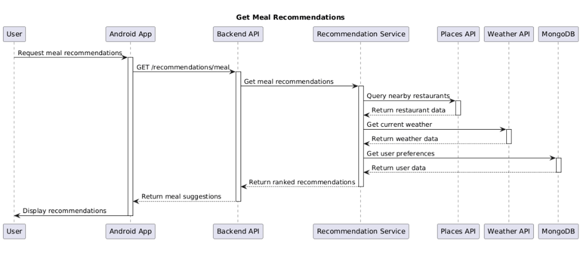

# Requirements and Design

## 1. Change History

| **Change Date**                              | **Modified Sections**                         | **Rationale**                                                                                                                                                                                                                                                                        |
| -------------------------------------------- | --------------------------------------------- | ------------------------------------------------------------------------------------------------------------------------------------------------------------------------------------------------------------------------------------------------------------------------------------ |
| 2025-11-23 ([16f79ff](../../commit/16f79ff)) | UI/UX, Map Presentation                        | Added a glow effect on selected pins so users can more easily recognize the active pitch/location on the map. |
| 2025-11-23 ([7eeb820](../../commit/7eeb820)) | UI/UX, Map Presentation                        | Re-introduced 3D buildings to maintain spatial context when navigating the map. |
| 2025-11-23 ([42eb198](../../commit/42eb198)) | Map Performance, Pin Rendering                 | Fixed the clustering logic so large pin concentrations remain legible and responsive under zoomed-out views. |
| 2025-11-23 ([3a8acf7](../../commit/3a8acf7)) | UI/UX                                         | Applied several minor interface tweaks to keep colors and spacing consistent after recent map updates. |
| 2025-11-23 ([4edc16f](../../commit/4edc16f)) | Animations, Map Rendering                      | Smoothed the map rendering animation, reducing visual jitter during tile refreshes. |
| 2025-11-23 ([81c78b3](../../commit/81c78b3)) | Animations, Map Rendering                      | Added a follow-up animation polish pass to ensure fluid transitions between map states. |
| 2025-11-23 ([0110d44](../../commit/0110d44)) | Real-time Sync                                 | Fixed the real-time pin update flow so edits propagate immediately to connected clients. |
| 2025-11-11 ([9060d9a](../../commit/9060d9a)) | Repository Sync                                | Merged the remote `main` branch to keep local work aligned with upstream changes before continuing new work. |
| 2025-11-10 ([915eecd](../../commit/915eecd)) | CI/Automation                                  | Addressed failing GitHub Actions steps so the pipeline could complete successfully. |
| 2025-11-10 ([2b9434b](../../commit/2b9434b)) | Documentation                                  | Updated the justifications section that tracks unresolved Codacy findings. |
| 2025-11-10 ([ce831a1](../../commit/ce831a1)) | Repository Sync                                | Pulled the latest changes from `main` to maintain parity with upstream work. |
| 2025-11-10 ([1dd5482](../../commit/1dd5482)) | Documentation, Testing                         | Added coverage screenshots to documentation so visual QA remains current. |
| 2025-11-10 ([b2e9bfe](../../commit/b2e9bfe)) | Testing                                        | Updated the E2E finish flow artifacts to reflect the state after stabilizing the UI. |
| 2025-11-10 ([feb27ef](../../commit/feb27ef)) | Documentation                                  | Refreshed the Requirements and Design documentation to capture the current product state before reporting. |
| 2025-11-10 ([b10b3ed](../../commit/b10b3ed)) | Documentation Assets                           | Added uploaded assets (images/diagrams) that illustrate recent flows. |
| 2025-11-10 ([6a1a6eb](../../commit/6a1a6eb)) | Documentation Assets                           | Removed the outdated `Recommend_Locations.png` asset to prevent stale references. |
| 2025-11-10 ([c97e943](../../commit/c97e943)) | Documentation Assets                           | Dropped the obsolete `Manage_Friends.png` now replaced by newer documentation visuals. |
| 2025-11-10 ([fefa9ec](../../commit/fefa9ec)) | Documentation Assets                           | Removed the `Manage_Account.png` asset that was superseded by updated UI mockups. |
| 2025-11-10 ([30953f4](../../commit/30953f4)) | Testing                                        | Revised the post-E2E finish definitions after additional UI tweaks. |
| 2025-11-10 ([e8dfd22](../../commit/e8dfd22)) | Testing                                        | Continued refining end-to-end test coverage to pass reliably across environments. |
| 2025-11-10 ([0d47a3a](../../commit/0d47a3a)) | Testing Documentation                         | Documented the updated testing process for clarity after recent automation refinements. |
| 2025-11-10 ([94de934](../../commit/94de934)) | Testing                                        | Confirmed the focused test suites were working after previous fix attempts. |
| 2025-11-10 ([0f30110](../../commit/0f30110)) | Testing                                        | Applied partial fixes to several failing tests to progress toward stability. |
| 2025-11-10 ([eedfe4c](../../commit/eedfe4c)) | Repository Sync                                | Pulled in upstream `main` changes while keeping the Codacy branch synchronized. |
| 2025-11-10 ([c4efbb5](../../commit/c4efbb5)) | Testing                                        | Verified the realtime gateway via dedicated unit tests after integration adjustments. |
| 2025-11-10 ([2433502](../../commit/2433502)) | Documentation                                  | Updated the change history section of this document to record work done up to that point. |
| 2025-11-10 ([1293f6d](../../commit/1293f6d)) | Repository Sync                                | Merged the remote `main` branch once more to minimize divergence. |
| 2025-11-10 ([682722b](../../commit/682722b)) | Code Quality                                  | Merged PR #23 that bundled several Codacy fixes into the branch. |
| 2025-11-10 ([fcf833a](../../commit/fcf833a)) | Code Quality                                  | Added another set of Codacy cleanups targeting new warnings. |
| 2025-11-10 ([9cd649b](../../commit/9cd649b)) | Code Quality                                  | Merged PR #22 to fold in additional Codacy adjustments. |
| 2025-11-10 ([803b63b](../../commit/803b63b)) | Code Quality                                  | Applied the next wave of Codacy fixes within the codacy-fixes branch. |
| 2025-11-10 ([83ea953](../../commit/83ea953)) | Code Quality                                  | Merged PR #21 to add yet more Codacy remediation work. |
| 2025-11-10 ([5cfef53](../../commit/5cfef53)) | Code Quality                                  | Synced `codacy-fixes` with upstream branches to keep linting aligned. |
| 2025-11-10 ([d05c99f](../../commit/d05c99f)) | Code Quality                                  | Applied further Codacy fixes after reviewing persistent findings. |
| 2025-11-10 ([c666bfb](../../commit/c666bfb)) | Code Quality                                  | Merged PR #20 to fold in additional Codacy cleanups. |
| 2025-11-10 ([554bdc1](../../commit/554bdc1)) | Code Quality                                  | Merged the main branch into `codacy-fixes` so the branch reflected the latest baseline. |
| 2025-11-10 ([fe5ff8b](../../commit/fe5ff8b)) | Code Quality, Tooling                         | Added even more Codacy fixes and committed the `.codacy.yml` config guiding the analysis. |
| 2025-11-10 ([d733234](../../commit/d733234)) | Code Quality                                  | Merged PR #19 that continued the Codacy cleanup cycle. |
| 2025-11-10 ([3a202a8](../../commit/3a202a8)) | Code Quality                                  | Added another wave of Codacy fixes for the Codacy branch. |
| 2025-11-03 ([2b9a2a0](../../commit/2b9a2a0)) | Requirements Specification, Use Cases         | Updated Use Case 10: Admin Review Reported Content - refined admin dashboard workflow with specific moderation actions (Clear Reports vs Delete Pin) and detailed report viewing                                                                                                     |
| 2025-11-03 ([2b9a2a0](../../commit/2b9a2a0)) | Requirements Specification, Use Cases         | Updated Use Case 10: Admin Review Reported Content - refined admin dashboard workflow with specific moderation actions (Clear Reports vs Delete Pin) and detailed report viewing                                                                                                     |
| 2025-11-03 ([ab4e5df](../../commit/ab4e5df)) | Requirements Specification, Use Cases         | Added Use Case 11: Remove Pin to Formal Use Case Specifications - documented pin deletion functionality for both users and admins with permission checks and confirmation flow                                                                                                       |
| 2025-11-03 ([dee9450](../../commit/dee9450)) | Pin Management, Use Cases                     | Updated Remove Pin use case - users can now remove their own pins in addition to admin removal capabilities                                                                                                                                                                          |
| 2025-10-25 ([041a90c](../../commit/041a90c)) | Frontend, User Management                     | User management changes - enhanced user profile management and UI improvements                                                                                                                                                                                                       |
| 2025-10-25 ([05af670](../../commit/05af670)) | Gamification, Badge System                    | Functionality for pin-creation-related badges - implemented achievement tracking for users creating pins                                                                                                                                                                             |
| 2025-10-25 ([09aac5c](../../commit/09aac5c)) | Frontend, Gamification                        | Integrated Badges backend with frontend - complete badge system UI implementation with backend integration                                                                                                                                                                           |
| 2025-10-25 ([1054552](../../commit/1054552)) | Real-time Updates, Bug Fixes                  | Fix: Location sockets working - resolved Socket.io connectivity issues for real-time location tracking                                                                                                                                                                               |
| 2025-10-25 ([11ce94f](../../commit/11ce94f)) | Real-time Updates, Social Features            | Fix: Location pings work and sockets working - implemented real-time location sharing between friends with Socket.io                                                                                                                                                                 |
| 2025-10-25 ([132f459](../../commit/132f459)) | Bug Fixes, Integration                        | Fixed Arav Code - resolved integration issues and merge conflicts                                                                                                                                                                                                                    |
| 2025-10-25 ([166e590](../../commit/166e590)) | Integration                                   | Merge branch 'main' into tony - synchronized development branches                                                                                                                                                                                                                    |
| 2025-10-25 ([1bc1282](../../commit/1bc1282)) | Integration, UI/UX                            | Merge pull request #4 from tonykulenovic/TomasFernandes169/AppUI - integrated UI improvements                                                                                                                                                                                        |
| 2025-10-25 ([1f56437](../../commit/1f56437)) | Authentication, Error Handling                | Fix: Frontend auth error codes updated - improved error handling and user feedback in authentication flow                                                                                                                                                                            |
| 2025-10-25 ([226f41e](../../commit/226f41e)) | Pin Management, Map Features                  | Added restaurant pre-seeded pins - integrated Google Maps API for restaurant discovery with enhanced metadata                                                                                                                                                                      |
| 2025-10-25 ([24f6154](../../commit/24f6154)) | Authentication, Bug Fixes                     | Fixed sign up issues - resolved user registration problems and improved signup flow                                                                                                                                                                                                  |
| 2025-10-25 ([25a98f1](../../commit/25a98f1)) | Pin Management, Social Features               | Add voting, reporting, category filtering, and enhanced metadata display features - comprehensive pin interaction system                                                                                                                                                             |
| 2025-10-25 ([25ff28d](../../commit/25ff28d)) | Pin Management, Privacy                       | Update: Added pin visibility options - implemented public/friends/private pin sharing controls                                                                                                                                                                                       |
| 2025-10-25 ([28b8d1e](../../commit/28b8d1e)) | Integration                                   | Merge pull request #3 from tonykulenovic/tony - integrated Tony's development work                                                                                                                                                                                                   |
| 2025-10-25 ([2cb847e](../../commit/2cb847e)) | Backend Services, Development                 | Add debugging endpoints - added development utilities and testing endpoints for debugging                                                                                                                                                                                            |
| 2025-10-25 ([32b52c4](../../commit/32b52c4)) | UI/UX Design, Frontend Architecture           | Added first iteration of UI - complete Material Design 3 implementation with navigation and feature screens                                                                                                                                                                          |
| 2025-10-25 ([3ba1006](../../commit/3ba1006)) | Bug Fixes, API                                | Fix npe for 200 response - resolved null pointer exception in API response handling                                                                                                                                                                                                  |
| 2025-10-25 ([3c87fc7](../../commit/3c87fc7)) | User Management, Frontend                     | Added username to Profile and Manage Profile - enhanced user identification system                                                                                                                                                                                                   |
| 2025-10-25 ([3ca0a0a](../../commit/3ca0a0a)) | Integration, Conflict Resolution              | Merge conflicts resolved: Tony and Main - resolved development branch conflicts                                                                                                                                                                                                      |
| 2025-10-25 ([6733d04](../../commit/6733d04)) | Requirements Specification, Features          | Added intelligent meal recommendation system with multi-factor scoring (proximity, meal relevance, weather, user preferences), Google Maps API integration, automated scheduling (breakfast 8-10am, lunch 12-2pm, dinner 6-10pm), and daily tracking to prevent spam notifications |
| 2025-10-25 ([44cab84](../../commit/44cab84)) | Documentation Structure, Project Organization | Move Requirements_and_Design.md into documentation directory - organized project documentation structure                                                                                                                                                                             |
| 2025-10-25 ([4c1b4d7](../../commit/4c1b4d7)) | UI/UX Design, Map Features                    | Fix: Maps now show different shade of colour - improved visual distinction and map readability                                                                                                                                                                                       |
| 2025-10-25 ([5a28089](../../commit/5a28089)) | Gamification, Badge System                    | Added functionality for login-streak-related badges and updated frontend badge design - login streak achievement tracking                                                                                                                                                            |
| 2025-10-25 ([5b8eec2](../../commit/5b8eec2)) | Integration                                   | Merge Tony Files - integrated pin and badge functionality from Tony's branch                                                                                                                                                                                                         |
| 2025-10-25 ([62d2d5a](../../commit/62d2d5a)) | Integration                                   | Merged Tony Code - synchronized development work                                                                                                                                                                                                                                     |
| 2025-10-25 ([69deb95](../../commit/69deb95)) | Integration, Location Tracking                | Merge pull request #5 from tonykulenovic/maka/friends/tracking - integrated location tracking features                                                                                                                                                                               |
| 2025-10-25 ([6f57648](../../commit/6f57648)) | Backend Architecture, API Design              | Add backend folder from makac1896/mvp_friends_skeleton branch - established friends management API, location tracking, Socket.io gateway                                                                                                                                             |
| 2025-10-25 ([7f2f9e1](../../commit/7f2f9e1)) | Bug Fixes, Pin Management                     | FIX: update pin button functions without error - resolved pin editing functionality issues                                                                                                                                                                                           |
| 2025-10-25 ([80b216d](../../commit/80b216d)) | Gamification, Backend Services                | Badge endpoints added - initial badge system implementation with models, tracking endpoints, and service logic                                                                                                                                                                       |
| 2025-10-25 ([8247c39](../../commit/8247c39)) | Requirements Specification, Documentation     | Update Requirements & Design document with current app state - comprehensive documentation update                                                                                                                                                                                    |
| 2025-10-25 ([862eab2](../../commit/862eab2)) | Integration, Pin Management                   | Merged Arav Section into main - integrated pin management and admin functionality                                                                                                                                                                                                    |
| 2025-10-25 ([8762443](../../commit/8762443)) | Push Notifications, Debugging                 | Push notifications not working - debugging Firebase Cloud Messaging implementation                                                                                                                                                                                                   |
| 2025-10-25 ([8ce6814](../../commit/8ce6814)) | Integration                                   | Merge pull request #9 from tonykulenovic/arav15 - integrated latest features from development                                                                                                                                                                                        |
| 2025-10-25 ([9582649](../../commit/9582649)) | UI/UX Design, Social Features                 | Fix: screens for friends and notifications - resolved UI/UX issues in social feature screens                                                                                                                                                                                         |
| 2025-10-25 ([990c27f](../../commit/990c27f)) | Backend Services, Testing                     | User location simulator - created testing utilities for location tracking simulation                                                                                                                                                                                                 |
| 2025-10-25 ([9e49769](../../commit/9e49769)) | Admin Functionality, User Management          | Update: Changed admins - updated admin user permissions and access controls                                                                                                                                                                                                          |
| 2025-10-25 ([a59e576](../../commit/a59e576)) | Integration                                   | Merge branch 'tony' of https://github.com/tonykulenovic/CPEN-321-app - synchronized Tony's work                                                                                                                                                                                      |
| 2025-10-25 ([a97ed5d](../../commit/a97ed5d)) | Social Features, Bug Fixes                    | Fix: Accept friend requests - resolved friend request acceptance functionality                                                                                                                                                                                                       |
| 2025-10-25 ([ac09cc4](../../commit/ac09cc4)) | Backend Services, Development                 | intermediate changes, currently not working - development work in progress                                                                                                                                                                                                           |
| 2025-10-25 ([b34e9c6](../../commit/b34e9c6)) | Integration, Pin Features                     | Merge pull request #6 from tonykulenovic/arav15 - integrated pin voting and reporting features                                                                                                                                                                                       |
| 2025-10-25 ([b612ae2](../../commit/b612ae2)) | Integration                                   | Merge branch 'TomasFernandes169/AppUI' - synchronized UI development branch                                                                                                                                                                                                          |
| 2025-10-25 ([b8b6668](../../commit/b8b6668)) | Push Notifications, Bug Fixes                 | Fix: push notifications - additional fixes for notification delivery system                                                                                                                                                                                                          |
| 2025-10-25 ([bb8350c](../../commit/bb8350c)) | Documentation, Requirements                   | Added Extra template requirements - enhanced documentation structure and requirements                                                                                                                                                                                                |
| 2025-10-25 ([bc91fe7](../../commit/bc91fe7)) | Privacy Controls, Social Features             | Privacy related settings updated - added granular privacy settings (profile visibility, location sharing, friend controls), FCM token storage                                                                                                                                        |
| 2025-10-25 ([be05342](../../commit/be05342)) | Pin Management, Map Features                  | Added pre-seeded library pins - integrated campus library locations with proper metadata and coordinates                                                                                                                                                                             |
| 2025-10-25 ([be3de4f](../../commit/be3de4f)) | Social Features, Bug Fixes                    | Fix: Fix issues related to friend deletion - resolved friendship management and deletion problems                                                                                                                                                                                    |
| 2025-10-25 ([be83ab1](../../commit/be83ab1)) | Pin Management, Map Features                  | Added restaurant pre-seeded pins - duplicate commit for restaurant location seeding                                                                                                                                                                                                  |
| 2025-10-25 ([c03c9e9](../../commit/c03c9e9)) | Push Notifications, Bug Fixes                 | Fix pushy - resolved push notification service issues and delivery problems                                                                                                                                                                                                          |
| 2025-10-25 ([c977708](../../commit/c977708)) | Documentation Structure, Organization         | Moved images into documentation directory - organized project assets and documentation structure                                                                                                                                                                                     |
| 2025-10-25 ([c9d6986](../../commit/c9d6986)) | Push Notifications, Technical Stack           | Push notifications working - successfully implemented Firebase Cloud Messaging with FCM token management                                                                                                                                                                             |
| 2025-10-25 ([ca03ca1](../../commit/ca03ca1)) | Push Notifications, Data Storage              | Fcm storing - implemented FCM token persistence and storage system                                                                                                                                                                                                                   |
| 2025-10-25 ([ccf7019](../../commit/ccf7019)) | Push Notifications, Bug Fixes                 | Fix: push notifications - resolved notification delivery and targeting issues                                                                                                                                                                                                        |
| 2025-10-25 ([cd9dfb0](../../commit/cd9dfb0)) | Pin Management, Bug Fixes                     | Fix: pre-seeded pin issues - resolved problems with seeding process and pin creation                                                                                                                                                                                                 |
| 2025-10-25 ([cf4ab4f](../../commit/cf4ab4f)) | Pin Management, Frontend                      | Add pin details screen with delete functionality - enhanced pin interaction with detailed view and management                                                                                                                                                                        |
| 2025-10-25 ([d3b89f3](../../commit/d3b89f3)) | Admin Functionality, Management               | Created Admin Screen. Can: Manage Pins, Ban/Delete Users. STILL NEED TO IMPLEMENT VIEW PIN REPORTS - comprehensive admin dashboard                                                                                                                                                   |
| 2025-10-25 ([d7eb3a5](../../commit/d7eb3a5)) | Gamification, Location Features               | Functionality for pin visiting badges - implemented location-based achievement tracking for visiting pins                                                                                                                                                                            |
| 2025-10-25 ([daa6c08](../../commit/daa6c08)) | Push Notifications, Development               | Push Notifications testing stage - initial Firebase integration setup and testing framework                                                                                                                                                                                          |
| 2025-10-25 ([ea8d419](../../commit/ea8d419)) | Integration                                   | Merge branch 'main' into tony - synchronized main branch changes with Tony's development work                                                                                                                                                                                        |
| 2025-10-25 ([f174305](../../commit/f174305)) | Bug Fixes, Frontend                           | Fix: Manage Profile no longer crashes - resolved frontend profile management stability and crash issues                                                                                                                                                                              |
| 2025-10-25 ([f1a71e1](../../commit/f1a71e1)) | Pin Management, Map Features                  | Added coffee pre-seeded pins - integrated Google Maps API for cafe discovery with proper icons and metadata                                                                                                                                                                        |
| 2025-10-25 ([f3af94c](../../commit/f3af94c)) | Social Features, Search                       | Fix: search friends - improved friend discovery functionality and search algorithm                                                                                                                                                                                                   |
| 2025-10-25 ([f3cf5f8](../../commit/f3cf5f8)) | Integration                                   | Merged Tony Code - additional synchronization of Tony's development work                                                                                                                                                                                                             |
| 2025-10-25 ([f706e5d](../../commit/f706e5d)) | Pin Management, Frontend                      | Integrated Manage Pins into frontend - complete pin CRUD operations integrated into UI                                                                                                                                                                                               |
| 2025-10-25 ([f8a5716](../../commit/f8a5716)) | Social Features, Frontend                     | Integrated manage friends system to frontend (NEEDS TESTING) - complete friends management UI implementation                                                                                                                                                                         |
| 2025-10-25 ([fd1a02b](../../commit/fd1a02b)) | Pin Management, Map Features                  | Added Pin Search Feature. Also added pin zoom focus feature - enhanced map interaction and pin discovery capabilities                                                                                                                                                                |
| 2025-10-25 ([ff0e417](../../commit/ff0e417)) | Pin Management, Bug Fixes                     | Fix: pre-seeded pin coords - corrected location coordinates for seeded pin content and improved accuracy                                                                                                                                                                             |
| 2025-10-25 ([132f459](../../commit/132f459)) | Bug Fixes                                     | Fixed Arav Code - resolved integration issues                                                                                                                                                                                                                                        |
| 2025-10-25 ([8247c39](../../commit/8247c39)) | Requirements Specification, Documentation     | Update Requirements & Design document with current app state                                                                                                                                                                                                                         |
| 2025-10-24 ([69deb95](../../commit/69deb95)) | Integration                                   | Merge pull request #5 from maka/friends/tracking - location tracking features                                                                                                                                                                                                        |
| 2025-10-24 ([11ce94f](../../commit/11ce94f)) | Real-time Updates, Social Features            | Fix: Location pings work and sockets working - implemented real-time location tracking via Socket.io with friend location sharing and privacy controls                                                                                                                               |
| 2025-10-24 ([1054552](../../commit/1054552)) | Real-time Updates                             | Fix: Location sockets working - resolved Socket.io connectivity and location broadcasting                                                                                                                                                                                            |
| 2025-10-24 ([b34e9c6](../../commit/b34e9c6)) | Integration                                   | Merge pull request #6 from arav15 - integrated pin voting and reporting features                                                                                                                                                                                                     |
| 2025-10-24 ([25a98f1](../../commit/25a98f1)) | Pin Management, Map Features                  | Add voting, reporting, category filtering, and enhanced metadata display features                                                                                                                                                                                                    |
| 2025-10-24 ([d7eb3a5](../../commit/d7eb3a5)) | Gamification, Badge System                    | Functionality for pin visiting badges - implemented location-based achievement tracking                                                                                                                                                                                              |
| 2025-10-24 ([fd1a02b](../../commit/fd1a02b)) | Pin Management, Map Features                  | Added Pin Search Feature and pin zoom focus feature - enhanced map interaction and pin discovery                                                                                                                                                                                     |
| 2025-10-24 ([166e590](../../commit/166e590)) | Integration                                   | Merge branch 'main' into tony - synchronized development branches                                                                                                                                                                                                                    |
| 2025-10-24 ([ea8d419](../../commit/ea8d419)) | Integration                                   | Merge branch 'main' into tony                                                                                                                                                                                                                                                        |
| 2025-10-24 ([9e49769](../../commit/9e49769)) | Admin Functionality                           | Update: Changed admins - updated admin user permissions                                                                                                                                                                                                                              |
| 2025-10-24 ([5a28089](../../commit/5a28089)) | Gamification, Badge System                    | Added functionality for login-streak-related badges and updated frontend badge design                                                                                                                                                                                                |
| 2025-10-24 ([5b8eec2](../../commit/5b8eec2)) | Integration                                   | Merge Tony Files - integrated pin and badge functionality                                                                                                                                                                                                                            |
| 2025-10-24 ([daa6c08](../../commit/daa6c08)) | Push Notifications                            | Push Notifications testing stage - initial Firebase integration setup                                                                                                                                                                                                                |
| 2025-10-24 ([bc91fe7](../../commit/bc91fe7)) | Privacy Controls, Social Features             | Privacy related settings updated - added granular privacy settings (profile visibility, location sharing preferences, friend request controls), FCM token storage                                                                                                                    |
| 2025-10-24 ([ca03ca1](../../commit/ca03ca1)) | Push Notifications                            | Fcm storing - implemented FCM token persistence                                                                                                                                                                                                                                      |
| 2025-10-24 ([3ba1006](../../commit/3ba1006)) | Bug Fixes                                     | Fix npe for 200 response - resolved null pointer exception in API responses                                                                                                                                                                                                          |
| 2025-10-24 ([ccf7019](../../commit/ccf7019)) | Push Notifications                            | Fix: push notifications - resolved notification delivery issues                                                                                                                                                                                                                      |
| 2025-10-24 ([b8b6668](../../commit/b8b6668)) | Push Notifications                            | Fix: push notifications - additional notification fixes                                                                                                                                                                                                                              |
| 2025-10-24 ([8762443](../../commit/8762443)) | Push Notifications                            | Push notifications not working - debugging notification system                                                                                                                                                                                                                       |
| 2025-10-24 ([c03c9e9](../../commit/c03c9e9)) | Push Notifications                            | Fix pushy - resolved push notification service issues                                                                                                                                                                                                                                |
| 2025-10-24 ([c977708](../../commit/c977708)) | Documentation Structure                       | Moved images into documentation directory - organized project assets                                                                                                                                                                                                                 |
| 2025-10-24 ([bb8350c](../../commit/bb8350c)) | Requirements Specification                    | Added Extra template requirements - enhanced documentation structure                                                                                                                                                                                                                 |
| 2025-10-24 ([44cab84](../../commit/44cab84)) | Documentation Structure                       | Move Requirements_and_Design.md into documentation directory - organized project documentation                                                                                                                                                                                       |
| 2025-10-23 ([05af670](../../commit/05af670)) | Gamification, Badge System                    | Functionality for pin-creation-related badges - implemented achievement tracking for user-generated content                                                                                                                                                                          |
| 2025-10-23 ([f1a71e1](../../commit/f1a71e1)) | Pin Management, Technical Stack               | Added coffee pre-seeded pins - integrated Google Maps API for cafe discovery with proper icons and metadata                                                                                                                                                                        |
| 2025-10-23 ([d3b89f3](../../commit/d3b89f3)) | Admin Functionality                           | Created Admin Screen with pin management, user banning/deletion capabilities (still need to implement view pin reports)                                                                                                                                                              |
| 2025-10-23 ([25ff28d](../../commit/25ff28d)) | Pin Management                                | Update: Added pin visibility options - implemented public/friends/private pin sharing controls                                                                                                                                                                                       |
| 2025-10-23 ([990c27f](../../commit/990c27f)) | Backend Services                              | User location simulator - created testing utilities for location tracking                                                                                                                                                                                                            |
| 2025-10-23 ([ac09cc4](../../commit/ac09cc4)) | Backend Services                              | Intermediate changes, currently not working - development in progress                                                                                                                                                                                                                |
| 2025-10-22 ([4c1b4d7](../../commit/4c1b4d7)) | UI/UX Design                                  | Fix: Maps now show different shade of colour - improved visual distinction                                                                                                                                                                                                           |
| 2025-10-22 ([7f2f9e1](../../commit/7f2f9e1)) | Bug Fixes                                     | FIX: update pin button functions without error - resolved pin editing functionality                                                                                                                                                                                                  |
| 2025-10-22 ([cf4ab4f](../../commit/cf4ab4f)) | Pin Management                                | Add pin details screen with delete functionality - enhanced pin interaction capabilities                                                                                                                                                                                             |
| 2025-10-22 ([ff0e417](../../commit/ff0e417)) | Pin Management                                | Fix: pre-seeded pin coords - corrected location coordinates for seeded content                                                                                                                                                                                                       |
| 2025-10-22 ([cd9dfb0](../../commit/cd9dfb0)) | Pin Management                                | Fix: pre-seeded pin issues - resolved seeding process problems                                                                                                                                                                                                                       |
| 2025-10-22 ([be05342](../../commit/be05342)) | Pin Management                                | Added pre-seeded library pins - integrated campus library locations with proper metadata                                                                                                                                                                                             |
| 2025-10-21 ([f706e5d](../../commit/f706e5d)) | Pin Management, Frontend                      | Integrated Manage Pins into frontend - complete pin CRUD operations in UI                                                                                                                                                                                                            |
| 2025-10-21 ([862eab2](../../commit/862eab2)) | Integration                                   | Merged Arav Section into main - integrated pin and admin functionality                                                                                                                                                                                                               |
| 2025-10-20 ([09aac5c](../../commit/09aac5c)) | Gamification, Frontend                        | Integrated Badges backend with frontend - complete badge system UI implementation                                                                                                                                                                                                    |
| 2025-10-20 ([1bc1282](../../commit/1bc1282)) | Integration                                   | Merge pull request #4 from TomasFernandes169/AppUI - integrated UI improvements                                                                                                                                                                                                      |
| 2025-10-20 ([1f56437](../../commit/1f56437)) | Authentication, Bug Fixes                     | Fix: Frontend auth error codes updated - improved error handling in authentication flow                                                                                                                                                                                              |
| 2025-10-20 ([be3de4f](../../commit/be3de4f)) | Social Features                               | Fix: Fix issues related to friend deletion - resolved friendship management problems                                                                                                                                                                                                 |
| 2025-10-20 ([a97ed5d](../../commit/a97ed5d)) | Social Features                               | Fix: Accept friend requests - resolved friend request acceptance functionality                                                                                                                                                                                                       |
| 2025-10-20 ([f3af94c](../../commit/f3af94c)) | Social Features                               | Fix: search friends - improved friend discovery and search functionality                                                                                                                                                                                                             |
| 2025-10-20 ([b612ae2](../../commit/b612ae2)) | Integration                                   | Merge branch TomasFernandes169/AppUI - synchronized UI development                                                                                                                                                                                                                   |
| 2025-10-20 ([2cb847e](../../commit/2cb847e)) | Backend Services                              | Add debugging endpoints - added development and testing utilities                                                                                                                                                                                                                    |
| 2025-10-20 ([24f6154](../../commit/24f6154)) | Authentication                                | Fixed sign up issues - resolved user registration problems                                                                                                                                                                                                                           |
| 2025-10-20 ([f8a5716](../../commit/f8a5716)) | Social Features, Frontend                     | Integrated manage friends system to frontend (NEEDS TESTING) - complete friends management UI                                                                                                                                                                                        |
| 2025-10-20 ([3c87fc7](../../commit/3c87fc7)) | User Management                               | Added username to Profile and Manage Profile - enhanced user identification                                                                                                                                                                                                          |
| 2025-10-20 ([9582649](../../commit/9582649)) | UI/UX Design                                  | Fix: screens for friends and notifications - resolved UI/UX issues in social features                                                                                                                                                                                                |
| 2025-10-20 ([28b8d1e](../../commit/28b8d1e)) | Integration                                   | Merge pull request #3 from tony - integrated Tony's development work                                                                                                                                                                                                                 |
| 2025-10-20 ([f3cf5f8](../../commit/f3cf5f8)) | Integration                                   | Merged Tony Code - synchronized development work                                                                                                                                                                                                                                     |
| 2025-10-20 ([62d2d5a](../../commit/62d2d5a)) | Integration                                   | Merged Tony Code - additional synchronization                                                                                                                                                                                                                                        |
| 2025-10-20 ([3ca0a0a](../../commit/3ca0a0a)) | Integration                                   | Merge conflicts resolved: Tony and Main - resolved development conflicts                                                                                                                                                                                                             |
| 2025-10-19 ([6f57648](../../commit/6f57648)) | Backend Architecture, API Design              | Add backend folder from makac1896/mvp_friends_skeleton branch - established friends management API endpoints, location tracking with real-time updates, Socket.io gateway architecture                                                                                               |
| 2025-10-19 ([32b52c4](../../commit/32b52c4)) | UI/UX Design, Frontend Architecture           | Added first iteration of UI - complete UI overhaul with Material Design 3, navigation system, screens for all major features (badges, friends, profile, maps), and Android Jetpack Compose implementation                                                                            |
| 2025-10-16 ([80b216d](../../commit/80b216d)) | Gamification, Backend Services                | Badge endpoints added - initial badge system implementation with badge models, achievement tracking endpoints, badge service logic, and API documentation                                                                                                                            |

---

## 2. Project Description

**UniVerse** is a mobile-first Android application designed for university students to navigate campus life more effectively. The app provides an interactive map of campus locations, including pre-seeded libraries and cafes, along with community-created pins for study spaces, events, chill areas, and shops.

**Core Features:**

- **Interactive Map**: Real-time map with Google Maps integration showing pins with voting, reporting, and category filtering
- **Pin Management**: Create, edit, and manage community pins with enhanced metadata (capacity, crowd levels, opening hours)
- **Social Features**: Connect with friends, view friend locations (with privacy controls), and manage friend requests
- **Gamification**: Badge system with progress tracking for user activities and achievements
- **Admin Tools**: Content moderation, user management, and reported pin review for administrators
- **Privacy Controls**: Granular privacy settings for profile visibility, location sharing, and friend requests
- **Real-time Updates**: Push notifications and live location tracking via Socket.io

**Technical Stack:**

- **Backend**: Node.js, Express, MongoDB, Socket.io, Firebase Cloud Messaging
- **Frontend**: Android (Kotlin), Jetpack Compose, Material Design 3, Google Maps API
- **Authentication**: Google OAuth with credential management
- **Real-time**: Socket.io for live updates and location tracking

Target audience: university students who want an easy way to discover study spots, food options, and campus events, while staying connected with friends in a privacy-conscious environment.

---

## 3. Requirements Specification

### **3.1. List of Features**

- **View Map**: Display pre-seeded pins, user-created pins, and friend locations with real-time updates. Filter pins by category (Study, Events, Chill, Shops/Services).
- **Manage Pins**: Create, update, and delete community pins (study spaces, events, chill areas, shops). Vote on pins (upvote/downvote), report inappropriate content, and view enhanced pin details with capacity, crowd levels, and opening hours.
- **Manage Account**: Create, update, or delete an account, view profile attributes, badges, and friends. Control privacy settings including profile visibility, location sharing, and friend request preferences. Receive push notifications for account-related events.
- **Manage Friends**: Send friend requests, maintain a friends list, and view friend profiles. Share real-time locations with friends (with privacy controls).
- **Badge System**: Earn badges for activities, view progress, and track achievements.
- **Recommend Locations**: Suggest location/pins based on user preferences, time of day, and location data.

---

### **3.2. Use Case Diagram**

---

### **3.3. Actors Description**

1. **Student User**: A student using the app to find study spots, food, events, and to connect with friends.  
2. **Admin**: Admins to review reports of unsafe content/pins and remove them.  
3. **Google OAuth 2.0**: External identity provider that enables secure, token-based Google account sign-in for users.  
4. **Firebase Cloud Messaging**: Push notification service that delivers alerts about friends, recommendations, and system messages to devices.  
5. **OpenWeather API**: Weather data provider used for contextual recommendations (e.g., adapting pin suggestions based on current conditions).  
6. **Google Maps API**: Mapping platform powering the apps map display, routing, and place pins.

---

### **3.4. Use Case Description**

### Feature 1: View Map
1. **View Pins**: Student User opens the map to see campus libraries and food spots and pins added by others.
2. **Filter Pins by Category**: Student User can filter pins by category (Study, Events, Chill, Shops/Services).
3. **View Friend Locations**: Student User can see real-time locations of friends (with privacy controls).

### Feature 2: Manage Pins
4. **Add Pin**: Student User adds a new study space/event pin with enhanced metadata.
5. **View Pin Details**: Student User clicks a pin to see name, description, capacity, crowd level, and opening hours.
6. **Vote on Pin**: Student User can upvote or downvote pins to show approval/disapproval.
7. **Report Pin**: Student User reports a community-created pin as unsafe or inappropriate.
8. **View Reported Pins**: Admin can view and manage reported pins.
9. **Remove Pin**: Student User and admin can remove pins from the map.

### Feature 3: Manage Account
10. **Sign Up**: Student User can sign up for the app with their Google account.
11. **Log In**: Student User can log in to the app with their Google account after they have signed up.
12. **Log Out**: Student User can log out of the app.
13. **Delete Account**: Student User can delete their account.
14. **Manage Profile**: Student User can manage their profile for the app.
15. **Manage Privacy Settings**: Student User can control profile visibility, location sharing, and friend request preferences.
16. **Manage User Accounts**: Admin can suspend, unsuspend, or delete user accounts.

### Feature 4: Manage Friends
17. **Add Friend**: Student User searches for a classmate by username/email and sends a request.
18. **View Friend Profile**: Student User views a friend's badges and activity (respecting privacy settings).
19. **Remove Friend**: Student User can remove a friend from their friend network.
20. **Manage Friend Requests**: Student User can accept, decline, or block friend requests.

### Feature 5: Badge System
21. **Earn Badge**: Student User receives a profile badge for activity (e.g., daily logins, time at library).
22. **View Badges**: Student User views unlocked profile badges and progress toward new ones.
23. **Track Badge Progress**: Student User can see progress toward earning new badges.

### Feature 6: Smart Notifications & Recommendations
24. **Receive Notifications**: Student User receives push notifications for friend requests, system messages, and personalized recommendations.
25. **Get Food Recommendations**: App sends contextual food suggestions (e.g., lunch, coffee break, or dinner times).
26. **Get Personalized Recommendations**: App notifies Student Users of relevant pins based on preferences, time, and location.

**Recommendation failure handling**: When the recommendation feed cannot be retrieved, the recommendations panel displays a friendly Recommendations temporarily unavailable message plus a Retry action so Student Users know to try again when the service stabilizes.

### **3.5. Formal Use Case Specifications (10 Most Major Use Cases)**

#### Use Case 1: Add Pin

**Description**: A Student User adds a new pin for a study space, event, or chill spot.  
**Primary actor(s)**: Student User  

**Main success scenario**:

1. Student User selects the Add Pin option.  
2. Student User enters pin details (name, category, description).  
3. Student User submits pin.  
4. Pin icon appears on the map immediately and a confirmation toast lets the Student User know the location is live for everyone to see.  

**Failure scenario(s)**:

- 1a. Student User has no internet connection, so the app displays a connectivity error banner and keeps the Add Pin form open for retry.  
    - 1a1. The system reiterates the error next to the submit button and invites the Student User to retry.  
- 3a. Student User submits incomplete details.  
    - 3a1. The form highlights the missing inputs and shows an inline error message so the Student User can complete the fields.

---

#### Use Case 2: View Pin Details

**Description**: A Student User taps a pin on the map to see its information.  
**Primary actor(s)**: Student User  

**Main success scenario**:

1. Student User taps the pin on the map.  
2. System loads and displays the pin details for the Student User.  
3. Pin details (category, activity level, ratings) remain visible while the Student User reviews them.  

**Failure scenario(s)**:

- 1a. The pin has been deleted, and race conditions/synchronization issues occur.  
    - 1a1. The system shows pin no longer available.  
- 2a The Student User has no active/slow internet connection
    - 2a1. The system shows a connectivity error and asks the Student User to retry

---

#### Use Case 3: Earn Badge

**Description**: A Student User earns a badge after fulfilling a requirement.  
**Primary actor(s)**: Student User  

**Main success scenario**:

1. Student User meets badge condition (e.g., logs in daily for 5 days).  
2. The app confirms the condition, shows an unlock animation, and adds the badge to the Student Users collection.  
3. Student User sees the new badge appear in their profile along with updated progress for the next one.  

**Failure scenario(s)**:

- 1a. The badge service cannot confirm the condition because of connection issues.  
    - 1a1. The Student User sees a Badge temporarily unavailable message with a Retry option.

---

#### Use Case 4: Add Friend

**Description**: A student sends a friend request to another student.  
**Primary actor(s)**: Student User  

**Main success scenario**:

1. Student User searches for another student by username/email.  
2. System matches and shows a potential friend.  
3. Student User sends request.  
4. Friend accepts, both are added to each others friend lists, and the Student User sees a confirmation banner indicating the connection succeeded.  

**Failure scenario(s)**:

- 1a. No matching username found.  
    - 1a1. The system shows user not found.  
- 3a. Request fails to send due to connection issues.  
    - 3a1. The system shows an error and retries.  

---

#### Use Case 5: Vote on Pin

**Description**: Student User votes on a pin to show approval or disapproval.  
**Primary actor(s)**: Student User

**Main success scenario**:

1. Student User taps on a pin to view details.
2. Student User taps the upvote or downvote button.
3. System updates the displayed rating so the Student User immediately sees how the vote affected the pin.
4. Pin displays updated vote count to all Student Users.

**Failure scenario(s)**:

- 1a. Student User has already voted on this pin.
  - 1a1. System prevents duplicate voting and shows current vote status.
- 2a. Network connection fails during vote submission.
  - 2a1. System shows error message and allows retry.

---

#### Use Case 6: Report Pin

**Description**: Student User reports a pin as inappropriate or unsafe content.  
**Primary actor(s)**: Student User

**Main success scenario**:

1. Student User taps on a pin to view details.
2. Student User taps the "Report" button.
3. Student User selects a reason for reporting and provides additional details.
4. System confirms the report with a success message and notifies admins.
5. Student User receives confirmation that the report was submitted and remains on the pin details screen.

**Failure scenario(s)**:

- 1a. Student User tries to report their own pin.
  - 1a1. System prevents self-reporting, hides the report button, and shows an inline explanation.
- 2a. Report submission fails due to network issues.
  - 2a1. System shows error message and allows retry.

---

#### Use Case 7: Filter Pins by Category

**Description**: Student User filters map pins by category to find specific types of locations.  
**Primary actor(s)**: Student User

**Main success scenario**:

1. Student User opens the map view.
2. Student User taps on category filter buttons (Study, Events, Chill, Shops).
3. Map updates to show only pins of the selected category.
4. Student User can select multiple categories or clear filters.

**Failure scenario(s)**:

- 1a. No pins exist for the selected category.
  - 1a1. System shows "No pins found" message.
- 2a. Filter request fails due to network issues.
  - 2a1. System shows error message and reverts to showing all pins.

---

#### Use Case 8: Receive Notifications

**Description**: Student User receives real-time notifications for app events.  
**Primary actor(s)**: Student User, Firebase Cloud Messaging

**Main success scenario**:

1. System event occurs (friend request, pin update, etc.).
2. A push notification is delivered via Firebase and appears on the Student User's device.
3. Student User's device displays the notification, letting the Student User know about the event.
4. Student User taps notification to open relevant app section.

**Failure scenario(s)**:

- 1a. Student User has disabled notifications.
  - 1a1. System respects Student User preferences and does not send notifications.
- 2a. FCM token is invalid or expired.
  - 2a1. System attempts to refresh token and retry notification.

---

#### Use Case 9: Manage Privacy Settings

**Description**: Student User controls their privacy and visibility settings.  
**Primary actor(s)**: Student User  

**Main success scenario**:

1. Student User navigates to privacy settings.
2. Student User adjusts profile visibility, location sharing, and friend request preferences.
3. The settings page confirms "Changes saved" so the Student User sees the update succeeded.
4. Settings take effect immediately for all Student Users.

**Failure scenario(s)**:

- 1a. Privacy settings update fails due to network issues.
  - 1a1. System shows error message and allows retry.
- 2a. Invalid privacy setting values are submitted.
  - 2a1. System validates input and shows appropriate error messages.

---

#### Use Case 10: View Reported Pins

**Description**: Admin reviews and moderates reported pins through the admin dashboard.  
**Primary actor(s)**: Admin

**Main success scenario**:

1. Admin accesses the admin dashboard and selects "Review Reported Pins".
2. System displays list of all pins with reports (showing pin name, creator, number of reports, and status).
3. Admin expands a reported pin to view detailed report information (reporter name, reason, timestamp).
4. Admin takes action on the pin:
   - **Clear Reports**: Dismisses all reports and resets pin status to active (if reports were false).
   - **Delete Pin**: Permanently removes the pin from the system.
5. The reported pins list refreshes and the pin entry shows the updated status so the Admin can confirm the action succeeded.

**Failure scenario(s)**:

- 4a. Moderation action fails due to network or system error.
  - 4a1. System shows error message and allows retry.
- 4b. Pin has already been deleted by another admin or the creator.
  - 4b1. System shows "Pin not found" error and refreshes the list.

---

#### Use Case 11: Remove Pin

**Description**: A Student User or admin deletes a pin from the map. Regular Student Users may only delete pins they created. Admins may delete any user-created pin. Deletion is permanent and requires confirmation.  
**Primary actor(s)**: Regular Student User (Pin Owner), Admin

**Main success scenario**:

1. Actor selects a pin to remove.  
2. System displays a delete option (only if actor has permission).  
3. Actor selects the delete option.  
4. System shows a confirmation dialog.  
5. Actor confirms deletion.  
6. System removes the pin, eliminating it from the map data.
7. UI updates and the pin disappears from the map or admin list so the Student User or Admin sees the change immediately.
8. System displays a success message confirming the deletion.

**Failure scenario(s)**:

- 1a. Actor does not have permission to delete the pin.  
    - 1a1. Delete button is not shown and a tooltip explains the permission restriction.  
- 4a. Actor cancels deletion.  
    - 4a1. Dialog closes and no changes occur.  
- 5a. Network or backend error occurs during deletion.  
    - 5a1. System shows an error message and pin is not removed.  
- 6a. Pin no longer exists due to simultaneous deletion.  
    - 6a1. System informs the actor and refreshes the UI.

---

### **3.6. Screen Mock-ups**

(Optional  can be added later if time permits.)

### 3.7 Non-Functional Requirements

1. **Performance**  
   Map pins shall appear within **2 seconds** because Student Users expect instant spatial context when arriving on campus; slow loading will hurt adoption, so indexed queries on category, location, user_id, and status keep updates fast. Pin updates during panning also refresh quickly, and real-time actions (voting, notifications) surface results within **1 second** to mirror the responsiveness of commercial campus mapping tools.

2. **Scalability**  
   The backend shall support at least **500 concurrent student users**roughly the size of a busy campus commons during peak periodsand still deliver responses in **2 seconds** so the platform remains useful when multiple cohorts browse pins simultaneously. Pagination (20 pins per page) and TTL indexes keep payloads and storage predictable, enabling horizontal scaling as usage grows.

3. **Security**  
   All sensitive student data (friend connections, badges, location history, privacy settings) shall be **encrypted in transit and at rest** because campus Wi-Fi is shared and prone to eavesdropping. JWT authentication, Zod schema validation, and explicit privacy controls for location sharing prevent unauthorized access, while sanitized inputs keep injection threats at bay.

4. **Reliability**  
   The system shall maintain **99% uptime** so students can rely on the map and social features throughout the day; graceful degradation surfaces user-friendly errors when external services fail while keeping authentication and pin viewing functional. Centralized logging and retries capture anomalies for quick remediation.

5. **Usability**  
   The app follows Material Design 3, live updates via Socket.io, and responsive mobile-first layouts so Student Users can complete core tasks (view pins, vote, report) within **30 seconds** of installing the app, minimizing friction during busy campus schedules.

6. **Privacy**  
   The system provides granular privacy controls for profile visibility, location sharing precision, and friend request preferences so Student Users can share only what they intend. Location data carries TTL (Time To Live) for automatic cleanup, and enforcement across the app prevents accidental oversharing.

---

## 4. Designs Specification

### **4.1. Main Components**

1. **Authentication**

   - **Purpose**: Handles Google OAuth login for all users with credential management.
   - **Rationale**: Using Google OAuth avoids building a custom authentication system and leverages an external trusted identity provider.
   - **Interfaces**: 
     1. **Google OAuth Integration**
        - **REST**: `POST /api/auth/signin` - Authenticates user with Google ID token
        - **Java**: `GoogleUserInfo authenticateUser(String googleIdToken)` - Validates Google ID token and returns user information
        - **REST**: `POST /api/auth/signup` - Creates new user account with Google OAuth
        - **Java**: `String generateJWT(String userId, String email)` - Creates JWT token for authenticated user
        - **REST**: `POST /api/auth/check` - Checks if Google account exists in system
        - **Java**: `boolean validateJWT(String token)` - Validates JWT token and returns authentication status
     2. **Credential Manager**
        - **Java**: `void storeCredentials(String userId, String refreshToken)` - Stores user credentials securely
        - **Java**: `String getRefreshToken(String userId)` - Retrieves stored refresh token for user
        - **Java**: `void clearCredentials(String userId)` - Removes stored credentials on logout
     3. **JWT Token Service**
        - **Java**: `String createAccessToken(String userId, String email, String role)` - Generates access token with user claims
        - **Java**: `Claims verifyToken(String token)` - Verifies and decodes JWT token claims
        - **Java**: `boolean isTokenExpired(String token)` - Checks if token has expired

2. **Pins**

   - **Purpose**: Manages CRUD operations for pins (create, update, delete, view) with voting and reporting.
   - **Rationale**: Pins are the central content of the app, and isolating them in a component makes it easier to manage validation, reports, and updates.  
   - **Interfaces**: 
     1. **Pin CRUD Operations**
        - **REST**: `POST /api/pins` - Creates new pin with validation
        - **Java**: `Pin createPin(CreatePinRequest request, String userId)` - Creates new pin with validation
        - **REST**: `GET /api/pins/:id` - Retrieves pin details by ID
        - **Java**: `Pin getPinById(String pinId)` - Retrieves pin details by ID
        - **REST**: `PUT /api/pins/:id` - Updates existing pin
        - **Java**: `Pin updatePin(String pinId, UpdatePinRequest request, String userId)` - Updates existing pin
        - **REST**: `DELETE /api/pins/:id` - Deletes pin (owner or admin only)
        - **Java**: `boolean deletePin(String pinId, String userId)` - Deletes pin (owner or admin only)
        - **REST**: `GET /api/pins/search` - Searches pins with filtering and pagination
        - **Java**: `List<Pin> searchPins(SearchFilters filters)` - Searches pins with filtering and pagination
     2. **Voting System**
        - **REST**: `POST /api/pins/:id/rate` - Records user vote (upvote/downvote)
        - **Java**: `VoteResult votePin(String pinId, String userId, VoteType voteType)` - Records user vote (upvote/downvote)
        - **REST**: `GET /api/pins/:id/vote` - Gets user's vote status for pin
        - **Java**: `boolean hasUserVoted(String pinId, String userId)` - Checks if user has already voted
        - **Java**: `PinRating getPinRating(String pinId)` - Gets current vote counts and rating
     3. **Reporting System**
        - **REST**: `POST /api/pins/:id/report` - Reports pin for moderation
        - **Java**: `boolean reportPin(String pinId, String userId, String reason)` - Reports pin for moderation
        - **REST**: `GET /api/pins/admin/reported` - Gets all reported pins (admin only)
        - **Java**: `List<ReportedPin> getReportedPins()` - Gets all reported pins (admin only)
        - **REST**: `PATCH /api/pins/admin/:id/clear-reports` - Clears reports on pin (admin only)
        - **Java**: `boolean moderatePin(String pinId, ModerationAction action)` - Takes moderation action (admin only)
     4. **Pin Visits**
        - **REST**: `POST /api/pins/:id/visit` - Records user visit to pin location
        - **Java**: `boolean recordPinVisit(String pinId, String userId)` - Records user visit to pin location
     5. **Category Filtering**
        - **Java**: `List<Pin> getPinsByCategory(PinCategory category)` - Filters pins by category
        - **Java**: `List<Pin> getPinsByCategories(List<PinCategory> categories)` - Filters by multiple categories
     6. **Enhanced Metadata**
        - **Java**: `PinMetadata getPinMetadata(String pinId)` - Gets capacity, crowd level, opening hours
        - **Java**: `boolean updatePinMetadata(String pinId, PinMetadata metadata)` - Updates pin metadata

3. **User**

   - **Purpose**: Manages user profiles, privacy settings, and account operations.
   - **Rationale**: Centralized user management ensures consistent privacy controls and profile management across the app.
   - **Interfaces**:
     1. **Profile Management**
        - **REST**: `GET /api/user/profile` - Retrieves current user's profile information
        - **Java**: `User getUserProfile(String userId)` - Retrieves user profile information
        - **REST**: `GET /api/user/:userId/profile` - Retrieves friend's profile information
        - **Java**: `User createUserProfile(GoogleUserInfo googleUser)` - Creates new user profile from Google OAuth
        - **REST**: `POST /api/user/profile` - Updates user profile
        - **Java**: `User updateUserProfile(String userId, UpdateProfileRequest request)` - Updates user profile
        - **REST**: `DELETE /api/user/profile` - Deletes user account and all associated data
        - **Java**: `boolean deleteUserProfile(String userId)` - Deletes user account and all associated data
        - **REST**: `GET /api/user/me` - Gets current authenticated user information
        - **REST**: `GET /api/user/search` - Searches users by name or email
     2. **Privacy Settings**
        - **REST**: `PATCH /api/user/me/privacy` - Updates privacy settings
        - **Java**: `PrivacySettings getPrivacySettings(String userId)` - Gets user's privacy preferences
        - **Java**: `boolean updatePrivacySettings(String userId, PrivacySettings settings)` - Updates privacy settings
        - **Java**: `boolean isProfileVisible(String userId, String requesterId)` - Checks if profile is visible to requester
        - **Java**: `LocationSharingLevel getLocationSharingLevel(String userId)` - Gets user's location sharing preferences
     3. **FCM Token Management**
        - **REST**: `PUT /api/user/me/fcm-token` - Registers/updates FCM token for notifications
        - **Java**: `boolean updateFCMToken(String userId, String fcmToken)` - Registers/updates FCM token for notifications
        - **REST**: `DELETE /api/user/me/fcm-token` - Removes FCM token on logout
        - **Java**: `boolean removeFCMToken(String userId)` - Removes FCM token on logout
        - **Java**: `String getFCMToken(String userId)` - Retrieves user's FCM token for notifications
     4. **Account Operations (Admin)**
        - **REST**: `GET /api/user/admin/all` - Gets paginated list of all users (admin only)
        - **REST**: `PATCH /api/user/admin/:id/suspend` - Suspends user account (admin only)
        - **Java**: `boolean suspendUser(String userId, String reason)` - Suspends user account (admin only)
        - **REST**: `PATCH /api/user/admin/:id/unsuspend` - Unsuspends user account (admin only)
        - **Java**: `boolean unsuspendUser(String userId)` - Unsuspends user account (admin only)
        - **REST**: `DELETE /api/user/admin/:id` - Deletes user account by admin (admin only)
        - **Java**: `boolean isUserSuspended(String userId)` - Checks if user account is suspended

4. **Notifications**

   - **Purpose**: Manages push notifications for real-time updates and user engagement.
   - **Rationale**: Real-time notifications improve user engagement and keep users informed of important events.
   - **Interfaces**:
     1. **Firebase Integration**
        - **Java**: `boolean sendNotification(String fcmToken, String title, String body, Map<String, String> data)` - Sends push notification via FCM
        - **Java**: `boolean sendBulkNotifications(List<String> fcmTokens, String title, String body)` - Sends notification to multiple users
        - **Java**: `boolean sendNotificationToUser(String userId, String title, String body)` - Sends notification to specific user
     2. **Notification Types**
        - **Java**: `boolean sendFriendRequestNotification(String recipientId, String senderName)` - Sends friend request notification
        - **Java**: `boolean sendPinUpdateNotification(String userId, String pinName, String updateType)` - Sends pin update notification
        - **Java**: `boolean sendSystemNotification(String userId, String message)` - Sends system message notification
     3. **Token Management**
        - **Java**: `boolean registerFCMToken(String userId, String fcmToken)` - Registers FCM token for user
        - **Java**: `boolean unregisterFCMToken(String userId)` - Removes FCM token for user
        - **Java**: `List<String> getActiveFCMTokens(String userId)` - Gets all active FCM tokens for user
     4. **Notification Preferences**
        - **Java**: `NotificationSettings getNotificationSettings(String userId)` - Gets user's notification preferences
        - **Java**: `boolean updateNotificationSettings(String userId, NotificationSettings settings)` - Updates notification preferences
        - **Java**: `boolean isNotificationEnabled(String userId, NotificationType type)` - Checks if specific notification type is enabled

5. **Badges**

   - **Purpose**: Assigns badges based on user activity (logins, time spent at locations, reports).  
   - **Rationale**: A separate manager for badges allows us to implement custom logic and computations beyond simple CRUD, supporting gamification.  
   - **Interfaces**: 
     1. **Badge Assignment**
        - **REST**: `POST /api/badges/user/event` - Processes user activity and assigns badges
        - **Java**: `List<Badge> processUserActivity(String userId, ActivityType activityType, Map<String, Object> metadata)` - Processes user activity and assigns badges
        - **REST**: `GET /api/badges/user/earned` - Gets all badges earned by user
        - **Java**: `List<Badge> getEarnedBadges(String userId)` - Gets all badges earned by user
        - **Java**: `boolean assignBadge(String userId, String badgeId)` - Manually assigns badge to user
        - **Java**: `boolean hasBadge(String userId, String badgeId)` - Checks if user has specific badge
     2. **Progress Tracking**
        - **REST**: `GET /api/badges/user/progress` - Gets progress for all available badges
        - **Java**: `List<BadgeProgress> getAllBadgeProgress(String userId)` - Gets progress for all available badges
        - **Java**: `BadgeProgress getBadgeProgress(String userId, String badgeId)` - Gets progress toward specific badge
        - **REST**: `GET /api/badges/user/stats` - Gets user's badge statistics
        - **Java**: `boolean updateProgress(String userId, String badgeId, int progressValue)` - Updates progress for badge
     3. **Badge Display**
        - **REST**: `GET /api/badges` - Gets all available badges in system with optional filtering
        - **Java**: `List<Badge> getAvailableBadges()` - Gets all available badges in system
        - **REST**: `GET /api/badges/user/available` - Gets badges user hasn't earned yet
        - **Java**: `Badge getBadgeById(String badgeId)` - Gets specific badge details
        - **Java**: `List<Badge> getBadgesByCategory(BadgeCategory category)` - Gets badges by category
     4. **Admin Badge Management**
        - **Java**: `Badge createBadge(CreateBadgeRequest request)` - Creates new badge template (admin only)
        - **Java**: `Badge updateBadge(String badgeId, UpdateBadgeRequest request)` - Updates badge template (admin only)
        - **Java**: `boolean deleteBadge(String badgeId)` - Deletes badge template (admin only)

6. **Admin**

   - **Purpose**: Provides administrative functionality for content moderation and user management.
   - **Rationale**: Admin tools are essential for maintaining app quality and handling user reports.
   - **Interfaces**:
     1. **Content Moderation**
        - **REST**: `GET /api/pins/admin/reported` - Gets all reported pins for review (admin only)
        - **Java**: `List<ReportedPin> getReportedPins()` - Gets all reported pins for review
        - **REST**: `PATCH /api/pins/admin/:id/clear-reports` - Clears reports on pin (admin only)
        - **Java**: `boolean moderatePin(String pinId, ModerationAction action, String adminId)` - Takes moderation action on pin
        - **Java**: `boolean moderateUser(String userId, ModerationAction action, String adminId)` - Takes moderation action on user
        - **Java**: `List<ModerationLog> getModerationHistory(String adminId)` - Gets moderation history for admin
     2. **User Management**
        - **REST**: `GET /api/user/admin/all` - Gets paginated list of all users (admin only)
        - **Java**: `List<User> getAllUsers(int page, int limit)` - Gets paginated list of all users
        - **Java**: `User getUserById(String userId)` - Gets specific user details
        - **REST**: `PATCH /api/user/admin/:id/suspend` - Suspends user account (admin only)
        - **Java**: `boolean suspendUser(String userId, String reason, String adminId)` - Suspends user account
        - **REST**: `PATCH /api/user/admin/:id/unsuspend` - Unsuspends user account (admin only)
        - **Java**: `boolean unsuspendUser(String userId, String adminId)` - Unsuspends user account
        - **REST**: `DELETE /api/user/admin/:id` - Deletes user account by admin (admin only)
     3. **Analytics Dashboard**
        - **Java**: `SystemStats getSystemStatistics()` - Gets overall system usage statistics
        - **Java**: `UserActivityStats getUserActivityStats(String userId)` - Gets activity stats for specific user
        - **Java**: `PinStatistics getPinStatistics()` - Gets pin creation and interaction statistics
        - **Java**: `List<AdminAlert> getSystemAlerts()` - Gets system alerts and warnings
     4. **Report Management**
        - **REST**: `POST /api/pins/:id/report` - Creates new report for pin
        - **Java**: `boolean createReport(String reporterId, String targetId, ReportType type, String reason)` - Creates new report
        - **Java**: `List<Report> getReportsByType(ReportType type)` - Gets reports by type
        - **Java**: `boolean resolveReport(String reportId, String adminId, String resolution)` - Resolves report

7. **Friends**

   - **Purpose**: Manages friend connections, requests, and social features.
   - **Rationale**: Social features enhance user engagement and create a community aspect to the app.
   - **Interfaces**:
     1. **Friend Requests**
        - **REST**: `POST /api/friends/requests` - Sends friend request to user
        - **Java**: `boolean sendFriendRequest(String senderId, String recipientId)` - Sends friend request to user
        - **REST**: `GET /api/friends/requests` - Gets pending friend requests
        - **Java**: `List<FriendRequest> getPendingRequests(String userId)` - Gets pending friend requests
        - **REST**: `POST /api/friends/requests/:id/accept` - Accepts friend request
        - **Java**: `boolean acceptFriendRequest(String requestId, String userId)` - Accepts friend request
        - **REST**: `POST /api/friends/requests/:id/decline` - Declines friend request
        - **Java**: `boolean declineFriendRequest(String requestId, String userId)` - Declines friend request
     2. **Friend List Management**
        - **REST**: `GET /api/friends` - Gets user's friends list
        - **Java**: `List<Friend> getFriendsList(String userId)` - Gets user's friends list
        - **REST**: `DELETE /api/friends/:friendId` - Removes friend from list
        - **Java**: `boolean removeFriend(String userId, String friendId)` - Removes friend from list
        - **REST**: `PATCH /api/friends/:friendId` - Updates friend relationship (e.g., block/unblock)
        - **Java**: `boolean isFriend(String userId, String friendId)` - Checks if users are friends
        - **Java**: `List<Friend> searchFriends(String userId, String searchQuery)` - Searches friends by name
     3. **Privacy Controls**
        - **Java**: `boolean canViewProfile(String viewerId, String targetId)` - Checks if viewer can see target's profile
        - **Java**: `boolean canViewLocation(String viewerId, String targetId)` - Checks if viewer can see target's location
        - **Java**: `PrivacyLevel getFriendPrivacyLevel(String userId, String friendId)` - Gets privacy level for friend
     4. **Location Sharing**
        - **REST**: `GET /api/friends/locations` - Gets friends' shared locations
        - **Java**: `LocationData getFriendLocation(String userId, String friendId)` - Gets friend's shared location
        - **Java**: `boolean shareLocation(String userId, String friendId, LocationData location)` - Shares location with friend
        - **Java**: `boolean stopLocationSharing(String userId, String friendId)` - Stops sharing location with friend

8. **Recommendations**
   - **Purpose**: Fetches nearby food spots using Google Maps API and applies time-of-day rules.  
   - **Rationale**: Encapsulating recommendation logic separately allows us to combine external API data with custom filters (e.g., lunch vs. dinner).  
   - **Interfaces**: 
    1. **Google Maps Integration**
       - **Java**: `List<Place> searchNearbyPlaces(double latitude, double longitude, String type, int radius)` - Searches nearby places using Google Maps API
       - **Java**: `Place getPlaceDetails(String placeId)` - Gets detailed information about specific place
       - **Java**: `List<Place> getPlacesByType(String type, double latitude, double longitude)` - Gets places by specific type
     2. **Time-based Filtering**
       - **REST**: `GET /api/recommendations/:mealType` - Gets meal recommendations for current user (lunch/dinner)
       - **Java**: `List<Recommendation> getTimeBasedRecommendations(String userId, int hourOfDay)` - Gets recommendations based on time of day
       - **REST**: `POST /api/recommendations/notify/:mealType` - Sends recommendation notification to current user
       - **Java**: `List<Recommendation> getLunchRecommendations(String userId, double latitude, double longitude)` - Gets lunch recommendations
       - **Java**: `List<Recommendation> getDinnerRecommendations(String userId, double latitude, double longitude)` - Gets dinner recommendations
     3. **Personalized Recommendations**
       - **Java**: `List<Recommendation> getPersonalizedRecommendations(String userId, RecommendationType type)` - Gets personalized recommendations based on user preferences
       - **Java**: `boolean updateUserPreferences(String userId, UserPreferences preferences)` - Updates user's recommendation preferences
       - **Java**: `UserPreferences getUserPreferences(String userId)` - Gets user's recommendation preferences
     4. **Location-based Suggestions**
       - **Java**: `List<Pin> getNearbyPins(String userId, double latitude, double longitude, int radius)` - Gets nearby pins for user
       - **Java**: `List<Recommendation> getLocationBasedRecommendations(String userId, double latitude, double longitude)` - Gets location-based recommendations
       - **Java**: `boolean trackUserInteraction(String userId, String pinId, InteractionType type)` - Tracks user interaction for better recommendations

9. **Location**

   - **Purpose**: Manages user location updates and real-time location sharing.
   - **Rationale**: Location services enable real-time friend tracking and location-based features.
   - **Interfaces**:
     1. **Location Updates**
        - **REST**: `PUT /api/me/location` - Updates or creates user's current location
        - **Java**: `boolean updateUserLocation(String userId, LocationData location)` - Updates user's current location
        - **Java**: `LocationData getCurrentLocation(String userId)` - Gets user's current location
        - **Java**: `List<LocationHistory> getLocationHistory(String userId, Date startDate, Date endDate)` - Gets location history for user

10. **Media**

    - **Purpose**: Handles image uploads and media management for user profiles and pins.
    - **Rationale**: Centralized media management ensures consistent handling of file uploads and storage.
    - **Interfaces**:
      1. **Image Upload**
         - **REST**: `POST /api/media/upload` - Uploads image file (profile picture or pin image)
         - **Java**: `String uploadImage(File imageFile, String userId, MediaType type)` - Uploads image and returns file path
         - **Java**: `boolean deleteImage(String imagePath)` - Deletes image file from storage
         - **Java**: `String getImageUrl(String imagePath)` - Gets public URL for image file

---

### **4.2. Databases**

1. **MongoDB Database**
   - **Purpose**: Stores user data (profiles, friends), pins, badges, and reports.  
   - **Rationale**: MongoDB provides flexible document-based storage, which fits dynamic user-generated content like pins and metadata.  

---

### **4.3. External Modules**

1. **Google Maps API**  

   - **Purpose**: Displays the interactive map with custom markers and clustering plus provides nearby place data (open/closed status, names, coordinates) for recommendations and seeded cafe pins.  
   - **Implementation**: Android integration uses Google Maps for rendering, while the Places endpoints supply cafe and restaurant metadata for recommendations.

2. **Google OAuth**  

   - **Purpose**: Handles user authentication using an external identity provider.  
   - **Implementation**: Google OAuth SDK integration with JWT token generation for secure sign-in flows.

3. **Firebase Cloud Messaging (FCM)**

   - **Purpose**: Sends push notifications to mobile devices for real-time updates.
   - **Implementation**: Backend Firebase Admin SDK with FCM token management

4. **OpenWeather API**
   - **Purpose**: Provides current weather and forecast data to tailor recommendations (e.g., suggesting indoor spots when its raining).
   - **Implementation**: Backend service calls OpenWeather endpoints and caches results for short durations to enrich the recommendation engine.

---

### **4.4. Frameworks**

1. **Node.js + Express**  

   - **Purpose**: Backend REST API server.  
   - **Reason**: Lightweight, integrates well with MongoDB and external APIs.

2. **Socket.io**

   - **Purpose**: Web sockets for live updates and real-time communication
   - **Reason**: Live map updates, location tracking, and live recommendations using Socket.io

3. **Android Jetpack Compose**

   - **Purpose**: Modern Android UI framework for declarative UI development
   - **Reason**: Provides modern, reactive UI development with Material Design 3

4. **Hilt (Dependency Injection)**

   - **Purpose**: Dependency injection framework for Android
   - **Reason**: Simplifies dependency management and improves testability

5. **Retrofit + OkHttp**

   - **Purpose**: HTTP client for Android API communication
   - **Reason**: Type-safe HTTP client with automatic JSON serialization

6. **MongoDB + Mongoose**

   - **Purpose**: NoSQL database for flexible document storage
   - **Reason**: Handles dynamic user-generated content and complex data relationships

7. **Firebase Admin SDK**
   - **Purpose**: Server-side Firebase integration for push notifications
   - **Reason**: Reliable push notification delivery with Firebase infrastructure

---

### **4.5. Dependencies Diagram**

---

### **4.6. Use Case Sequence Diagram (5 Most Major Use Cases)**

1. **Add Friend**
   

2. **Create Pin**
   

3. **Vote on Pin**
   

4. **Real-time Location Sharing**
   

5. **Get Meal Recommendations**
   

---

### **4.7. Design of Non-Functional Requirements**

#### **Current Implementation (Implemented)**

1. **Performance Requirements**

   - **Implementation**: Database queries are optimized using MongoDB compound indexes on frequently accessed fields (user_id, pin_category, location coordinates, status, visibility) with text search indexes on pin names and descriptions. Pagination is implemented with a default limit of 20 pins per page and skip-based pagination for efficient data retrieval. TTL indexes automatically clean up expired location data after 30 days, and regex-based text search provides fast filtering without full-text search overhead.

2. **Security Requirements**

   - **Implementation**: JWT tokens are generated with 24-hour expiration and include user ID, email, and role claims for stateless authentication. All API endpoints use Zod schemas for request validation and sanitization, preventing injection attacks and ensuring data integrity. Privacy controls are enforced at the service layer with granular permission checks for location sharing (off/live/approximate) and profile visibility (friends/everyone/private). Admin functions require role-based authorization middleware that validates admin status before allowing access.

3. **Reliability Requirements**

   - **Implementation**: All controller methods include try-catch blocks with specific error handling for network timeouts, database connection failures, and external API errors. The system gracefully degrades by returning cached data or default values when external services (Google Places, Firebase) are unavailable. Comprehensive logging is implemented using Winston logger with different log levels (info, warn, error) and structured logging for debugging and monitoring system health.

4. **Usability Requirements**
   - **Implementation**: The Android app uses Material Design 3 components with consistent theming, typography, and color schemes throughout all screens. Real-time updates are implemented using Socket.io for live location sharing, pin updates, and friend request notifications. Progressive loading is achieved with skeleton screens and loading states, while the responsive design uses Jetpack Compose's adaptive layouts for different screen sizes and orientations.

#### **Future Enhancements (Planned)**

1. **Advanced Performance**

   - **Planned**:
     - Redis caching for badge calculations and user statistics
     - CDN for static assets and images
     - Lazy loading optimizations for large datasets

2. **Scalability**

   - **Planned**:
     - Horizontal scaling with load balancers
     - Database sharding by geographic regions
     - Microservices architecture for independent scaling
     - Redis caching for session management

3. **Advanced Security**

   - **Planned**:
     - Rate limiting to prevent abuse
     - Advanced monitoring and alerting
     - Enhanced backup and recovery strategies

4. **Enhanced Usability**
   - **Planned**:
     - Offline support with local data caching
     - Advanced accessibility features
     - Performance monitoring and optimization
