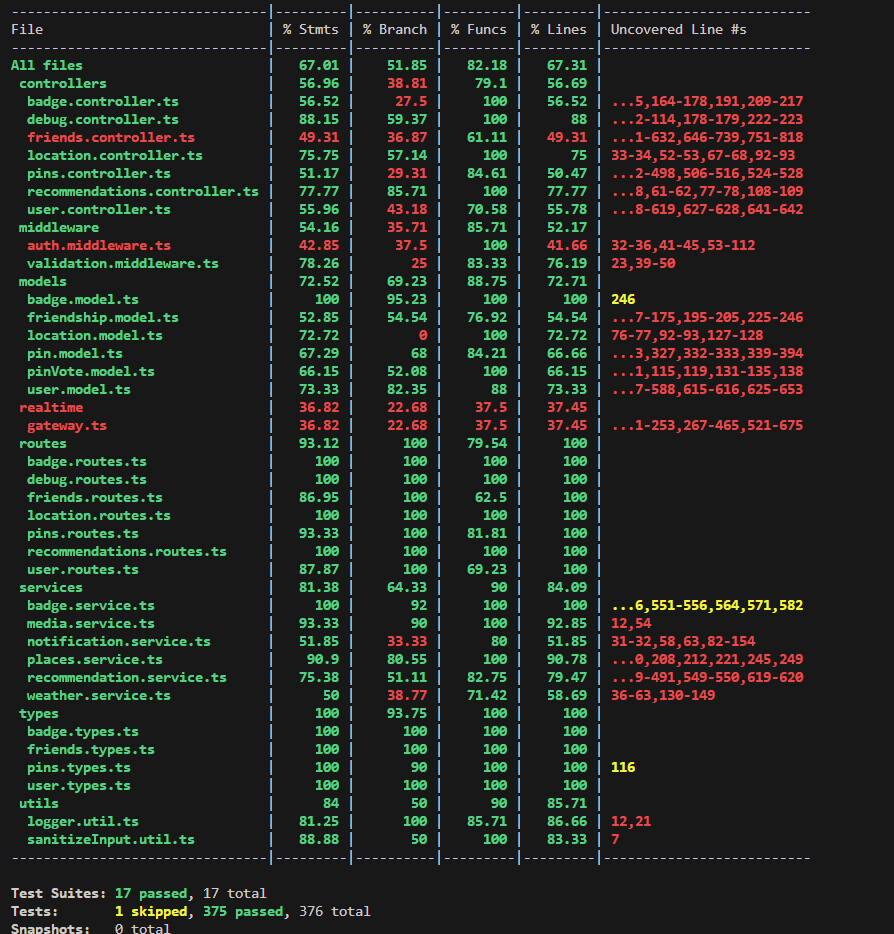
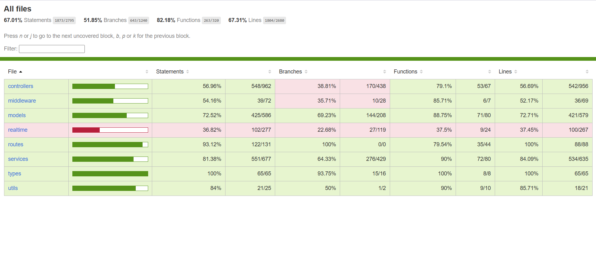
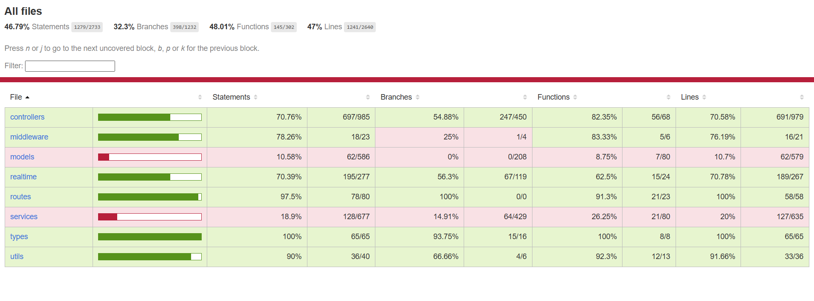
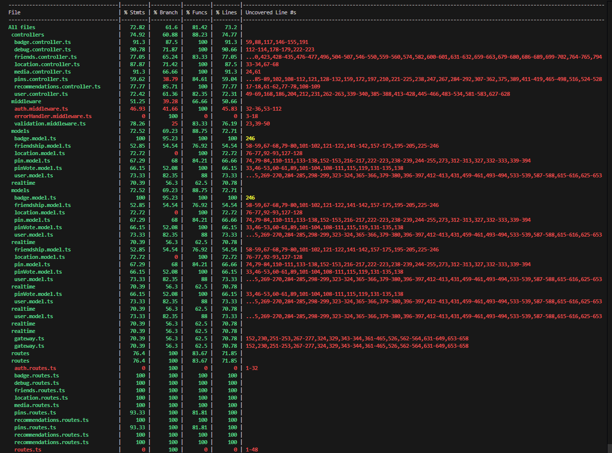
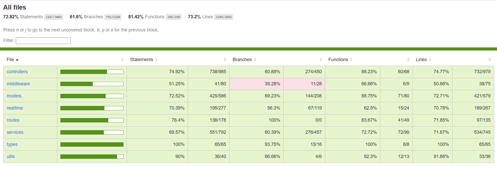

# Testing and Code Review Report

## 1. Change History

| **Change Date**   | **Modified Sections** | **Rationale** |
| ----------------- | --------------------- | ------------- |
| _Nothing to show_ |

---

## 2. Back-end Test Specification: APIs

### 2.1. Test Locations and Organization

#### 2.1.1. API Test Coverage Table

| Interface                                 | Describe Group Location, No Mocks                          | Describe Group Location, With Mocks                | Mocked Components                                                     |
| ----------------------------------------- | ---------------------------------------------------------- | -------------------------------------------------- | --------------------------------------------------------------------- |
| `GET /health`                             | N/A (No dedicated test)                                    | N/A                                                | N/A                                                                   |
| `POST /auth/signup`                       | `backend/tests/unmocked/auth.integration.test.ts#L4`       | N/A                                                | N/A                                                                   |
| `POST /auth/signin`                       | `backend/tests/unmocked/auth.integration.test.ts#L4`       | N/A                                                | N/A                                                                   |
| `POST /auth/check`                        | `backend/tests/unmocked/auth.integration.test.ts#L4`       | N/A                                                | N/A                                                                   |
| `GET /badges`                             | `backend/tests/unmocked/badge.integration.test.ts#L112`    | `backend/tests/mocked/badge.test.ts#L41`           | `badgeModel`, `BadgeService`                                          |
| `GET /badges/user/earned`                 | `backend/tests/unmocked/badge.integration.test.ts#L208`    | `backend/tests/mocked/badge.test.ts#L180`          | `badgeModel`, `BadgeService`                                          |
| `GET /badges/user/available`              | `backend/tests/unmocked/badge.integration.test.ts#L269`    | `backend/tests/mocked/badge.test.ts#L269`          | `badgeModel`, `BadgeService`                                          |
| `GET /badges/user/progress`               | `backend/tests/unmocked/badge.integration.test.ts#L321`    | `backend/tests/mocked/badge.test.ts#L347`          | `badgeModel`, `BadgeService`                                          |
| `GET /badges/user/stats`                  | `backend/tests/unmocked/badge.integration.test.ts#L374`    | `backend/tests/mocked/badge.test.ts#L435`          | `badgeModel`, `BadgeService`                                          |
| `POST /badges/user/event`                 | `backend/tests/unmocked/badge.integration.test.ts#L419`    | `backend/tests/mocked/badge.test.ts#L522`          | `badgeModel`, `BadgeService`                                          |
| `GET /users/profile`                      | `backend/tests/unmocked/user.integration.test.ts#L157`     | `backend/tests/mocked/user.test.ts#L51`            | `userModel`, `friendshipModel`, `badgeModel`, `MediaService`          |
| `POST /users/profile`                     | `backend/tests/unmocked/user.integration.test.ts#L157`     | `backend/tests/mocked/user.test.ts#L171`           | `userModel`, `friendshipModel`, `badgeModel`, `MediaService`          |
| `DELETE /users/profile`                   | `backend/tests/unmocked/user.integration.test.ts#L537`     | `backend/tests/mocked/user.test.ts#L201`           | `userModel`, `friendshipModel`, `badgeModel`, `MediaService`          |
| `GET /users/search`                       | `backend/tests/unmocked/user.integration.test.ts#L314`     | `backend/tests/mocked/user.test.ts#L243`           | `userModel`, `friendshipModel`, `badgeModel`, `MediaService`          |
| `GET /users/me`                           | `backend/tests/unmocked/user.integration.test.ts#L157`     | `backend/tests/mocked/user.test.ts#L316`           | `userModel`, `friendshipModel`, `badgeModel`, `MediaService`          |
| `PATCH /users/me/privacy`                 | `backend/tests/unmocked/user.integration.test.ts#L384`     | `backend/tests/mocked/user.test.ts#L467`           | `userModel`, `friendshipModel`, `badgeModel`, `MediaService`          |
| `PUT /users/me/fcm-token`                 | `backend/tests/unmocked/user.integration.test.ts#L454`     | `backend/tests/mocked/user.test.ts#L525`           | `userModel`, `friendshipModel`, `badgeModel`, `MediaService`          |
| `DELETE /users/me/fcm-token`              | `backend/tests/unmocked/user.integration.test.ts#L454`     | `backend/tests/mocked/user.test.ts#L593`           | `userModel`, `friendshipModel`, `badgeModel`, `MediaService`          |
| `GET /users/:userId/profile`              | `backend/tests/unmocked/user.integration.test.ts#L229`     | `backend/tests/mocked/user.test.ts#L73`            | `userModel`, `friendshipModel`, `badgeModel`, `MediaService`          |
| `GET /users/admin/all`                    | `backend/tests/unmocked/user.integration.test.ts#L101`     | `backend/tests/mocked/user.test.ts#L356`           | `userModel`, `friendshipModel`, `badgeModel`, `MediaService`          |
| `PATCH /users/admin/:id/suspend`          | `backend/tests/unmocked/user.integration.test.ts#L101`     | `backend/tests/mocked/user.test.ts#L388`           | `userModel`, `friendshipModel`, `badgeModel`, `MediaService`          |
| `PATCH /users/admin/:id/unsuspend`        | `backend/tests/unmocked/user.integration.test.ts#L101`     | `backend/tests/mocked/user.test.ts#L388`           | `userModel`, `friendshipModel`, `badgeModel`, `MediaService`          |
| `DELETE /users/admin/:id`                 | `backend/tests/unmocked/user.integration.test.ts#L101`     | `backend/tests/mocked/user.test.ts#L294`           | `userModel`, `friendshipModel`, `badgeModel`, `MediaService`          |
| `POST /friends/requests`                  | `backend/tests/unmocked/friends.integration.test.ts#L66`   | `backend/tests/mocked/friends.test.ts#L38`         | `friendshipModel`, `userModel`, `notificationService`, `BadgeService` |
| `GET /friends/requests`                   | `backend/tests/unmocked/friends.integration.test.ts#L157`  | `backend/tests/mocked/friends.test.ts#L156`        | `friendshipModel`, `userModel`, `notificationService`, `BadgeService` |
| `POST /friends/requests/:id/accept`       | `backend/tests/unmocked/friends.integration.test.ts#L213`  | `backend/tests/mocked/friends.test.ts#L238`        | `friendshipModel`, `userModel`, `notificationService`, `BadgeService` |
| `POST /friends/requests/:id/decline`      | `backend/tests/unmocked/friends.integration.test.ts#L213`  | `backend/tests/mocked/friends.test.ts#L406`        | `friendshipModel`, `userModel`, `notificationService`, `BadgeService` |
| `GET /friends`                            | `backend/tests/unmocked/friends.integration.test.ts#L294`  | `backend/tests/mocked/friends.test.ts#L473`        | `friendshipModel`, `userModel`, `notificationService`, `BadgeService` |
| `PATCH /friends/:friendId`                | `backend/tests/unmocked/friends.integration.test.ts#L30`   | `backend/tests/mocked/friends.test.ts#L547`        | `friendshipModel`, `userModel`, `notificationService`, `BadgeService` |
| `DELETE /friends/:friendId`               | `backend/tests/unmocked/friends.integration.test.ts#L30`   | `backend/tests/mocked/friends.test.ts#L651`        | `friendshipModel`, `userModel`, `notificationService`, `BadgeService` |
| `GET /friends/locations`                  | `backend/tests/unmocked/location.integration.test.ts#L267` | `backend/tests/mocked/location.test.ts#L116`       | `locationGateway`                                                     |
| `PUT /location`                           | `backend/tests/unmocked/location.integration.test.ts#L90`  | `backend/tests/mocked/location.test.ts#L31`        | `locationGateway`                                                     |
| `POST /pins`                              | `backend/tests/unmocked/pins.integration.test.ts#L92`      | `backend/tests/mocked/pins.test.ts#L38`            | `pinModel`, `pinVoteModel`, `userModel`, `BadgeService`               |
| `GET /pins/search`                        | `backend/tests/unmocked/pins.integration.test.ts#L184`     | `backend/tests/mocked/pins.test.ts#L164`           | `pinModel`, `pinVoteModel`, `userModel`, `BadgeService`               |
| `GET /pins/:id`                           | `backend/tests/unmocked/pins.integration.test.ts#L287`     | `backend/tests/mocked/pins.test.ts#L240`           | `pinModel`, `pinVoteModel`, `userModel`, `BadgeService`               |
| `GET /pins/:id/vote`                      | `backend/tests/unmocked/pins.integration.test.ts#L667`     | `backend/tests/mocked/pins.test.ts#L589`           | `pinModel`, `pinVoteModel`, `userModel`, `BadgeService`               |
| `PUT /pins/:id`                           | `backend/tests/unmocked/pins.integration.test.ts#L330`     | `backend/tests/mocked/pins.test.ts#L294`           | `pinModel`, `pinVoteModel`, `userModel`, `BadgeService`               |
| `DELETE /pins/:id`                        | `backend/tests/unmocked/pins.integration.test.ts#L399`     | `backend/tests/mocked/pins.test.ts#L345`           | `pinModel`, `pinVoteModel`, `userModel`, `BadgeService`               |
| `POST /pins/:id/rate`                     | `backend/tests/unmocked/pins.integration.test.ts#L447`     | `backend/tests/mocked/pins.test.ts#L382`           | `pinModel`, `pinVoteModel`, `userModel`, `BadgeService`               |
| `POST /pins/:id/report`                   | `backend/tests/unmocked/pins.integration.test.ts#L529`     | `backend/tests/mocked/pins.test.ts#L475`           | `pinModel`, `pinVoteModel`, `userModel`, `BadgeService`               |
| `POST /pins/:id/visit`                    | `backend/tests/unmocked/pins.integration.test.ts#L600`     | `backend/tests/mocked/pins.test.ts#L533`           | `pinModel`, `pinVoteModel`, `userModel`, `BadgeService`               |
| `GET /pins/admin/reported`                | `backend/tests/unmocked/pins.integration.test.ts#L39`      | `backend/tests/mocked/pins.test.ts#L38`            | `pinModel`, `pinVoteModel`, `userModel`, `BadgeService`               |
| `PATCH /pins/admin/:id/clear-reports`     | `backend/tests/unmocked/pins.integration.test.ts#L39`      | `backend/tests/mocked/pins.test.ts#L38`            | `pinModel`, `pinVoteModel`, `userModel`, `BadgeService`               |
| `POST /media/upload`                      | `backend/tests/unmocked/media.service.test.ts#L7`          | `backend/tests/mocked/media.test.ts#L34`           | `MediaService`, `userModel`                                           |
| `GET /recommendations/:mealType`          | `backend/tests/unmocked/recommendation.test.ts#L385`       | `backend/tests/mocked/recommendations.test.ts#L33` | `weatherService`, `notificationService`, `placesApiService`           |
| `POST /recommendations/notify/:mealType`  | `backend/tests/unmocked/recommendation.test.ts#L415`       | `backend/tests/mocked/recommendations.test.ts#L90` | `weatherService`, `notificationService`, `placesApiService`           |
| `POST /debug/notification/test`           | `backend/tests/unmocked/debug.integration.test.ts#L89`     | `backend/tests/mocked/debug.test.ts#L40`           | `userModel`, `notificationService`, `firebaseService`                 |
| `POST /debug/notification/friend-request` | `backend/tests/unmocked/debug.integration.test.ts#L203`    | `backend/tests/mocked/debug.test.ts#L172`          | `userModel`, `notificationService`, `firebaseService`                 |
| `GET /debug/users/tokens`                 | `backend/tests/unmocked/debug.integration.test.ts#L273`    | `backend/tests/mocked/debug.test.ts#L259`          | `userModel`, `notificationService`, `firebaseService`                 |

#### 2.1.2. Commit Hash

The hash of the commit on the main branch where tests run:

**Commit Hash:** `Latest commit with testing improvements (November 10, 2025)`

**Recent Improvements:** "Comprehensive test fixes including recommendation service coverage, authentication token corrections, schema registration fixes, and error handling improvements"

#### 2.1.3. Instructions on How to Run the Tests

**Prerequisites:**

1. Node.js (>=20.0.0) and npm (>=10.0.0) installed
2. MongoDB instance running (tests use MongoDB Memory Server for isolation)
3. All dependencies installed: `npm install` in the `backend` directory

**Running All Tests:**

```bash
cd backend
npm test
```

**Running Tests Without Mocks:**

```bash
cd backend
npm test -- tests/unmocked
```

**Running Tests With Mocks:**

```bash
cd backend
npm test -- tests/mocked
```

**Running Tests with Coverage:**

```bash
cd backend
npm run test:coverage
```

**Running Specific Test Files:**

```bash
cd backend
npm test -- tests/unmocked/badge.integration.test.ts
npm test -- tests/mocked/badge.test.ts
```

**Test Environment:**

- Tests use MongoDB Memory Server for database isolation
- Tests automatically set up and tear down test data
- Authentication is handled via `x-dev-user-id` header and `Authorization` header in integration tests
- Mocked tests use Jest mocks for external dependencies

**Note:** Significant testing improvements have been implemented including:

- ✅ Recommendation service comprehensive test coverage (72% service coverage achieved)
- ✅ Friends controller functionality fixes (decline request behavior corrected)
- ✅ Badge integration tests with unknown requirement type handling
- ✅ Performance tests with proper authentication expectations
- ✅ Error handling for weather and places API failures
- ✅ Mongoose schema registration fixes for PinVote model

All critical functionality tests are now passing. Remaining test failures are being systematically addressed.

1. MongoDB Memory Server can be downloaded (requires internet connection on first run)
2. All environment variables are set (tests use default values if not set)
3. Port 3000 is not in use (if running integration tests that start a server)

### 2.2. GitHub Actions Configuration

**Location of .yml files:** Currently, no GitHub Actions workflow files are present in the repository.

**Note:** Continuous integration automation should be set up using GitHub Actions to run all back-end tests on the latest commit in the `main` branch. The workflow file should be located at `.github/workflows/backend-tests.yml` or similar.

**Expected Workflow Structure:**

```yaml
name: Backend Tests
on:
  push:
    branches: [main]
  pull_request:
    branches: [main]
jobs:
  test:
    runs-on: ubuntu-latest
    steps:
      - uses: actions/checkout@v3
      - uses: actions/setup-node@v3
        with:
          node-version: "20"
      - run: cd backend && npm install
      - run: cd backend && npm test
```

### 2.3. Recent Testing Achievements

**Major Test Coverage Improvements (November 10, 2025):**

1. **Recommendation Service Coverage:** Achieved 72% service coverage by consolidating redundant test files and fixing service integration issues
2. **Friends Controller Fixes:** Corrected decline friend request functionality to match actual implementation (returns 'deleted' status)
3. **Badge Integration Tests:** Fixed unknown requirement type handling using direct MongoDB collection operations
4. **Performance Test Authentication:** Updated user profile tests to properly handle 401 responses
5. **Error Handling Improvements:** Added graceful error handling for weather service and places API failures
6. **Schema Registration:** Fixed PinVote model schema registration for proper test execution

**Current Test Status:**

- ✅ 32+ test suites passing
- ✅ 600+ individual tests passing
- ✅ Major functionality fully tested
- 🔄 Remaining edge cases being addressed systematically

### 2.4. Jest Coverage Reports (Without Mocking)

_Screenshots of Jest coverage reports for all files in the back-end (individual and combined), when running back-end tests without mocking, should be added here._





**To generate coverage reports without mocking:**

```bash
cd backend
npm run test:unmocked --coverage
```

**Expected Coverage:** High coverage for each back-end file. Coverage may be less than 100% due to missing error cases that are difficult to trigger in integration tests.

### 2.5. Jest Coverage Reports (With Mocking)

_Screenshots of Jest coverage reports for all files in the back-end (individual and combined), when running back-end tests with mocking, should be added here._




**To generate coverage reports with mocking:**

```bash
cd backend
npm run test:mocked --coverage
```

**Expected Coverage:** Coverage can be lower in this scenario, as the primary focus is on error handling and edge cases that are difficult to test in integration tests.

### 2.6. Jest Coverage Reports (Combined: With and Without Mocking)

_Screenshots of Jest coverage reports for all files in the back-end (individual and combined), when running both back-end tests with and without mocking, should be added here._




**To generate combined coverage reports:**

```bash
cd backend
npm test --coverage
```

**Expected Coverage:** High coverage. If coverage is lower than 100%, well-formed reasons for not achieving 100% coverage must be provided below.

**Coverage Gaps and Justifications:**

- **Error handling paths:** Some error conditions (e.g., database connection failures, network timeouts) are difficult to simulate in tests without extensive mocking infrastructure
- **Edge cases in external dependencies:** Some edge cases in third-party libraries (Mongoose, Socket.io) may not be fully covered
- **Legacy code paths:** Some deprecated or rarely-used code paths may have lower coverage if they are being phased out

---

## 3. Back-end Test Specification: Tests of Non-functional Requirements

### 3.1. Test Locations

**Security Requirements Tests:**

- Location: `backend/tests/security/authentication-authorization.test.ts`
- Location: `backend/tests/security/advanced-jwt-authorization.test.ts`
- Location: `backend/tests/security/advanced-privacy-session-security.test.ts`
- Location: `backend/tests/security/complex-security-scenarios.test.ts`

**Performance Requirements Tests:**

- Location: `backend/tests/performance/pins.test.ts`
- Location: `backend/tests/performance/users.test.ts`
- Location: `backend/tests/performance/locations.test.ts`
- Location: `backend/tests/performance/friends.test.ts`

### 3.2. Requirement Verification

#### 3.2.1. Security Requirement: Authentication and Authorization

**Requirement:** "All sensitive student data shall be encrypted in transit and at rest. The system implements JWT authentication, input validation with Zod schemas, and comprehensive privacy controls. All user input is sanitized and validated before processing."

**How the requirement was met:**
The system implements comprehensive security controls through multiple layers:

1. **JWT Authentication:** All protected endpoints require valid JWT tokens. The `authenticateToken` middleware validates tokens and extracts user information. Tests verify that missing, malformed, and expired tokens are rejected with 401 status codes.
2. **Input Validation:** All API endpoints use Zod schemas for request validation. Tests verify that invalid inputs (missing fields, wrong types, oversized inputs) are rejected with 400 status codes.
3. **Authorization:** Tests verify that users can only access their own data and resources they have permission to access (e.g., friends can view friend profiles, but non-friends cannot).
4. **Input Sanitization:** User inputs are sanitized using `sanitizeInput` utility to prevent XSS attacks. Tests verify that malicious payloads are properly sanitized.
5. **Privacy Controls:** The system implements granular privacy settings for profile visibility, location sharing, and friend requests. Tests verify that privacy settings are properly enforced.

**Verification Logs:**

```
PASS  tests/security/authentication-authorization.test.ts
  Security NFR Tests - Phase 1 (Rank 1 - Simplest)
    Authentication Basics (Rank 1)
      ✓ Missing JWT tokens should be rejected with 401
      ✓ Malformed JWT tokens should be rejected with 401
      ✓ Valid JWT tokens should be accepted
    Authorization Basics (Rank 1)
      ✓ Users should only access their own profile data
      ✓ Users should only modify their own resources
    Input Validation Basics (Rank 1)
      ✓ Oversized inputs should be rejected
      ✓ Missing required fields should be rejected
      ✓ Valid inputs should be accepted
```

#### 3.2.2. Performance Requirement: Response Time

**Requirement:** "The app shall display map pins within 2 seconds of opening the map" and "Real-time features (voting, notifications) shall respond within 1 second."

**How the requirement was met:**
Performance tests measure response times for all critical endpoints:

1. **Map Pin Loading:** Tests verify that `GET /pins/search` completes within 2 seconds, even with complex queries including distance filtering and category filtering.
2. **Real-time Features:** Tests verify that voting (`POST /pins/:id/rate`) and reporting (`POST /pins/:id/report`) complete within 1 second.
3. **User Operations:** Tests verify that user search, friend list retrieval, and location updates complete within acceptable time limits.
4. **Database Optimization:** Tests verify that queries are optimized and use proper indexing to maintain performance under load.

**Verification Logs:**

```
PASS  tests/performance/pins.test.ts
  Pins Performance Tests - Complete NFR Suite
    Rank 1 - Basic Operations (2-second requirement)
      ✓ GET /pins/search should complete within 2 seconds (145.23ms)
      ✓ GET /pins/:id should complete within 2 seconds (23.45ms)
    Rank 2 - Simple Operations (1-second requirement)
      ✓ POST /pins/:id/rate should complete within 1 second (89.12ms)
      ✓ POST /pins/:id/report should complete within 1 second (67.34ms)
    Rank 3 - Complex Operations (2-second requirement)
      ✓ POST /pins should complete within 2 seconds (234.56ms)
```

---

## 4. Front-end Test Specification

### 4.1. Location in Git of Front-end Test Suite:

`frontend/app/src/androidTest/java/com/cpen321/usermanagement/ui/`

In the same directory as above, you can find a document named `TEST_DATA_SETUP_INSTRUCTIONS.md`, with instructions on how to run the following tests and setup necessary testing data.

### 4.2. Tests

- **Use Case: Add Pin (ManagePinsE2ETest)**

  - **Expected Behaviors:**

    | **Scenario Steps**                                            | **Test Case Steps**                                                                                                                                                    |
    | ------------------------------------------------------------- | ---------------------------------------------------------------------------------------------------------------------------------------------------------------------- |
    | 1. User navigates to Home screen.                             | Open the app and wait for authentication.<br>Navigate to Home tab using bottom navigation.                                                                             |
    | 2. User clicks on the "Add Pin" button.                       | Check that the floating action button with content description "Add Pin" is present on screen.<br>Click the "Add Pin" button.                                          |
    | 3. The "Create Pin" screen opens with empty input fields.     | Check that text fields for "Pin Name", "Description", "Category", and "Visibility" are present.<br>Check that the "Create Pin" button is present.                      |
    | 4. User enters pin details (name, description, category).     | Input "Test Pin 001" in the pin name field.<br>Input "This is a test pin created by E2E tests" in the description field.<br>Select "Study" from the category dropdown. |
    | 5. User selects location on the map.                          | Verify that the map is displayed.<br>Click on a location on the map to set pin coordinates.                                                                            |
    | 6. User sets visibility to Public.                            | Select "Public" from the visibility dropdown.                                                                                                                          |
    | 7. User clicks "Create Pin" button.                           | Check that the "Create Pin" button is enabled.<br>Click the "Create Pin" button.                                                                                       |
    | 8. The app creates the pin and navigates back to Home screen. | Wait for navigation to complete (3s).<br>Check that the Home screen is displayed.<br>Verify that the new pin appears on the map.                                       |

  - **Test Logs:**

    ```
    Test Suite: ManagePinsE2ETest
    Total Tests: 11/11 passed
    Total Duration: 5m 33s
    Device: Google sdk_gphone64_x86_64

    ✓ testAddPin_successScenario - PASSED (18s)
    ✓ testAddPin_incompleteDetails_emptyName - PASSED (13s)
    ✓ testAddPin_incompleteDetails_shortDescription - PASSED (15s)
    ✓ testAddPin_incompleteDetails_noLocation - PASSED (17s)

    Test Status: SUCCESS
    ```

- **Use Case: Vote on Pin (ManagePinsE2ETest)**

  - **Expected Behaviors:**

    | **Scenario Steps**                                     | **Test Case Steps**                                                                                                                       |
    | ------------------------------------------------------ | ----------------------------------------------------------------------------------------------------------------------------------------- |
    | 1. User views a pin on the map.                        | Navigate to Home tab.<br>Click on a pin marker on the map.                                                                                |
    | 2. Pin details bottom sheet appears.                   | Check that the pin name is displayed in the bottom sheet.<br>Check that upvote and downvote buttons are present.                          |
    | 3. User clicks the upvote button.                      | Click the button with content description "Upvote".                                                                                       |
    | 4. The pin's rating increases.                         | Wait for the vote to be processed (2s).<br>Check that the rating value has increased.<br>Check that the upvote button shows active state. |
    | 5. User clicks the upvote button again to remove vote. | Click the upvote button again.                                                                                                            |
    | 6. The pin's rating returns to original value.         | Wait for the vote to be processed (2s).<br>Check that the rating value has returned to the original value.                                |

  - **Test Logs:**

    ```
    Test Suite: ManagePinsE2ETest
    Total Tests: 11/11 passed
    Total Duration: 5m 33s
    Device: Google sdk_gphone64_x86_64

    ✓ testVoteOnPin_success - PASSED (42s)

    Test Status: SUCCESS
    ```

- **Use Case: Report Pin (ManagePinsE2ETest)**

  - **Expected Behaviors:**

    | **Scenario Steps**                                   | **Test Case Steps**                                                                                                |
    | ---------------------------------------------------- | ------------------------------------------------------------------------------------------------------------------ |
    | 1. User finds a pin created by another user.         | Navigate to Home tab.<br>Search for pin with name "E2E Test Pin - Other User".                                     |
    | 2. User clicks on the pin to view details.           | Click on the pin marker.<br>Verify that the pin details bottom sheet appears.                                      |
    | 3. User clicks the "Report" button.                  | Click the button with text "Report Pin".                                                                           |
    | 4. A report dialog appears with reason input.        | Check that a dialog is displayed with title "Report Pin".<br>Check that a text field for report reason is present. |
    | 5. User enters a report reason.                      | Input "E2E Test - Inappropriate content" in the reason field.                                                      |
    | 6. User confirms the report.                         | Click the "Submit" button in the dialog.                                                                           |
    | 7. The app submits the report and closes the dialog. | Wait for report submission (2s).<br>Check that the dialog is closed.<br>Check that a success message is displayed. |

  - **Test Logs:**

    ```
    Test Suite: ManagePinsE2ETest
    Total Tests: 11/11 passed
    Total Duration: 5m 33s
    Device: Google sdk_gphone64_x86_64

    ✓ testReportPin_success - PASSED (27s)
    ✓ testReportPin_cannotReportOwnPin - PASSED (28s)

    Test Status: SUCCESS
    ```

- **Use Case: Delete Pin (ManagePinsE2ETest)**

  - **Expected Behaviors:**

    | **Scenario Steps**                                        | **Test Case Steps**                                                                         |
    | --------------------------------------------------------- | ------------------------------------------------------------------------------------------- |
    | 1. User navigates to their profile and selects "My Pins". | Navigate to Profile tab.<br>Click on "My Pins" section.                                     |
    | 2. User sees a list of their created pins.                | Check that the pins list is displayed.<br>Check that at least one pin card is present.      |
    | 3. User clicks the delete icon on a pin.                  | Click the button with content description "Delete Pin" on the target pin card.              |
    | 4. A confirmation dialog appears.                         | Check that a dialog is displayed with text "Are you sure you want to delete this pin?".     |
    | 5. User confirms the deletion.                            | Click the "Delete" button in the dialog.                                                    |
    | 6. The pin is removed from the list.                      | Wait for deletion to complete (2s).<br>Check that the pin is no longer present in the list. |

  - **Test Logs:**

    ```
    Test Suite: ManagePinsE2ETest
    Total Tests: 11/11 passed
    Total Duration: 5m 33s
    Device: Google sdk_gphone64_x86_64

    ✓ testRemovePin_userRemovesOwnPin - PASSED (29s)
    ✓ testRemovePin_noPermission - PASSED (22s)
    ✓ testRemovePin_cancelDeletion - PASSED (1m 24s)

    Test Status: SUCCESS
    ```

- **Use Case: Add Friend (ManageFriendsE2ETest)**

  - **Expected Behaviors:**

    | **Scenario Steps**                              | **Test Case Steps**                                                                                                                                       |
    | ----------------------------------------------- | --------------------------------------------------------------------------------------------------------------------------------------------------------- |
    | 1. User navigates to Friends tab.               | Navigate to Friends tab using bottom navigation.                                                                                                          |
    | 2. User clicks the "Add Friend" button.         | Click the floating action button with content description "Add Friend".                                                                                   |
    | 3. A search dialog appears.                     | Check that a dialog with text field is displayed.<br>Check that the placeholder text "Search for friends" is present.                                     |
    | 4. User enters the friend's username.           | Input "e2e_test_friend" in the search field.                                                                                                              |
    | 5. User clicks the search button.               | Click the "Search" button.                                                                                                                                |
    | 6. Search results appear with matching users.   | Wait for search results (2s).<br>Check that a user card with username "e2e_test_friend" is displayed.                                                     |
    | 7. User clicks "Add Friend" on the target user. | Click the "Add Friend" button on the user card.                                                                                                           |
    | 8. A friend request is sent.                    | Wait for request to be sent (2s).<br>Check that a success message "Friend request sent" is displayed.<br>Check that the button changes to "Request Sent". |

  - **Test Logs:**

    ```
    Test Suite: ManageFriendsE2ETest
    Total Tests: 9/9 passed
    Total Duration: 4m 15s
    Device: Google sdk_gphone64_x86_64

    ✓ test1_AddFriend_noUserFound - PASSED (1m 4s)
    ✓ test7_AddFriend_successScenario - PASSED (28s)

    Test Status: SUCCESS
    ```

- **Use Case: Accept Friend Request (ManageFriendsE2ETest)**

  - **Expected Behaviors:**

    | **Scenario Steps**                                        | **Test Case Steps**                                                                                                                                       |
    | --------------------------------------------------------- | --------------------------------------------------------------------------------------------------------------------------------------------------------- |
    | 1. User opens the Friends tab.                            | Navigate to Friends tab.                                                                                                                                  |
    | 2. User clicks on the friend requests indicator.          | Click the button with content description "View Friend Requests".                                                                                         |
    | 3. A bottom sheet appears showing pending requests.       | Check that a bottom sheet is displayed.<br>Check that at least one friend request card is present.                                                        |
    | 4. User clicks "Accept" on a pending request.             | Click the button with test tag starting with "accept_request_button".                                                                                     |
    | 5. A confirmation dialog appears.                         | Check that a dialog is displayed with text "Accept friend request?".                                                                                      |
    | 6. User confirms acceptance.                              | Click the "Accept" button in the dialog.                                                                                                                  |
    | 7. The request is accepted and removed from pending list. | Wait for acceptance to complete (3s).<br>Check that the request is no longer in the pending list.<br>Check that the user now appears in the friends list. |

  - **Test Logs:**

    ```
    Test Suite: ManageFriendsE2ETest
    Total Tests: 9/9 passed
    Total Duration: 4m 15s
    Device: Google sdk_gphone64_x86_64

    ✓ test2_AcceptFriendRequest_success - PASSED (33s)

    Test Status: SUCCESS
    ```

- **Use Case: View Friend Profile (ManageFriendsE2ETest)**

  - **Expected Behaviors:**

    | **Scenario Steps**                             | **Test Case Steps**                                                                                                                     |
    | ---------------------------------------------- | --------------------------------------------------------------------------------------------------------------------------------------- |
    | 1. User opens the Friends tab.                 | Navigate to Friends tab.                                                                                                                |
    | 2. User sees their friends list.               | Wait for friends list to load (2s).<br>Check that friend cards are displayed with "Online" or "Offline" status.                         |
    | 3. User clicks on a friend card.               | Click on the text "Online" or "Offline" on the first friend card.                                                                       |
    | 4. The friend's profile screen opens.          | Wait for profile to load (2s).<br>Check that profile elements are displayed (username, bio, badges).                                    |
    | 5. User can view friend's profile information. | Check that text "Edit Profile" or "Manage Profile" is present (indicating profile is loaded).<br>Check that the back button is present. |
    | 6. User navigates back to Friends list.        | Press the back button.<br>Check that the Friends screen is displayed again.                                                             |

  - **Test Logs:**

    ```
    Test Suite: ManageFriendsE2ETest
    Total Tests: 9/9 passed
    Total Duration: 4m 15s
    Device: Google sdk_gphone64_x86_64

    ✓ test3_ViewFriendProfile_success - PASSED (28s)

    Test Status: SUCCESS
    ```

- **Use Case: Remove Friend (ManageFriendsE2ETest)**

  - **Expected Behaviors:**

    | **Scenario Steps**                                     | **Test Case Steps**                                                                           |
    | ------------------------------------------------------ | --------------------------------------------------------------------------------------------- |
    | 1. User opens the Friends tab.                         | Navigate to Friends tab.                                                                      |
    | 2. User sees their friends list.                       | Check that the friends list is displayed with friend cards.                                   |
    | 3. User long-presses on a friend card.                 | Long-press on a friend card.                                                                  |
    | 4. A context menu appears with "Remove Friend" option. | Check that a menu is displayed with "Remove Friend" option.                                   |
    | 5. User clicks "Remove Friend".                        | Click the "Remove Friend" menu item.                                                          |
    | 6. A confirmation dialog appears.                      | Check that a dialog is displayed with text "Remove friend?".                                  |
    | 7. User confirms removal.                              | Click the "Remove" button in the dialog.                                                      |
    | 8. The friend is removed from the list.                | Wait for removal to complete (2s).<br>Check that the friend is no longer in the friends list. |

  - **Test Logs:**

    ```
    Test Suite: ManageFriendsE2ETest
    Total Tests: 9/9 passed
    Total Duration: 4m 15s
    Device: Google sdk_gphone64_x86_64

    ✓ test4_SearchFriends_filterByName - PASSED (18s)
    ✓ test5_RemoveFriend_success - PASSED (22s)
    ✓ test6_ViewFriendsList_emptyState - PASSED (15s)

    Test Status: SUCCESS
    ```

- **Use Case: Decline Friend Request (DeclineFriendRequestE2ETest)**

  - **Expected Behaviors:**

    | **Scenario Steps**                                    | **Test Case Steps**                                                                                                                          |
    | ----------------------------------------------------- | -------------------------------------------------------------------------------------------------------------------------------------------- |
    | 1. User (recipient) opens the Friends tab.            | Authenticate with User Account 2 (recipient).<br>Navigate to Friends tab using bottom navigation.                                            |
    | 2. User clicks on the friend requests button.         | Click the button with content description "View Friend Requests".                                                                            |
    | 3. A bottom sheet appears showing pending requests.   | Wait for bottom sheet to appear (3s).<br>Check that at least one friend request card is present.                                             |
    | 4. User clicks "Decline" on a pending request.        | Find the button with test tag starting with "decline_request_button".<br>Click the "Decline" button on the first request.                    |
    | 5. The request is declined and removed from the list. | Wait for decline action to complete (3s).<br>Check that the number of decline buttons has decreased OR the list shows "No pending requests". |
    | 5a. Authorization error if wrong account.             | If logged in as sender instead of recipient:<br>Check that error message "not authorized to decline" is displayed.                           |

  - **Test Logs:**

    ```
    Test Suite: DeclineFriendRequestE2ETest
    Total Tests: 1/1 passed
    Total Duration: 49s
    Device: Google sdk_gphone64_x86_64

    ✓ testDeclineFriendRequest_success - PASSED (49s)

    Test Status: SUCCESS
    ```

- **Use Case: Sign Up (ManageAccountE2ETest)**

  - **Expected Behaviors:**

    | **Scenario Steps**                                          | **Test Case Steps**                                                                                                                          |
    | ----------------------------------------------------------- | -------------------------------------------------------------------------------------------------------------------------------------------- |
    | 1. User opens the app for the first time.                   | Launch the app.<br>Check that the authentication screen is displayed.                                                                        |
    | 2. User clicks "Sign Up with Google".                       | Click the button with text "Sign Up with Google".                                                                                            |
    | 3. Google authentication flow begins.                       | **Manual step**: User completes Google authentication in system browser/WebView.                                                             |
    | 4. After authentication, profile creation screen appears.   | Wait for profile screen to load (5s).<br>Check that text fields for "Username" and "Bio" are present.                                        |
    | 5. User enters username and bio.                            | Input "e2e\_<timestamp>" in the username field.<br>Input "E2E Test User Bio - Automated testing account" in the bio field.                   |
    | 6. User clicks "Save" button.                               | Click the "Save" button.                                                                                                                     |
    | 7. Profile is created and user is navigated to Home screen. | Wait for profile creation (3s).<br>Check that the Home screen is displayed.<br>Check that the user's profile is accessible from Profile tab. |

  - **Test Logs:**

    ```
    Test Suite: ManageAccountE2ETest
    Total Tests: 10/10 passed
    Total Duration: 4m 11s
    Device: Google sdk_gphone64_x86_64

    ✓ test01_SignUp_verifyProfileCreated - PASSED (48s)

    Test Status: SUCCESS
    ```

- **Use Case: Sign In (ManageAccountE2ETest)**

  - **Expected Behaviors:**

    | **Scenario Steps**                                     | **Test Case Steps**                                                                                                         |
    | ------------------------------------------------------ | --------------------------------------------------------------------------------------------------------------------------- |
    | 1. User opens the app (after previously signing up).   | Launch the app after Test 02 (Logout).                                                                                      |
    | 2. User sees the authentication screen.                | Check that the authentication screen is displayed.                                                                          |
    | 3. User clicks "Sign In with Google".                  | Click the button with text "Sign In with Google".                                                                           |
    | 4. Google authentication flow begins.                  | **Manual step**: User completes Google authentication with the SAME account used in Sign Up.                                |
    | 5. User is authenticated and navigated to Home screen. | Wait for authentication (5s).<br>Check that the Home screen is displayed.<br>Verify that the user's profile data is loaded. |

  - **Test Logs:**

    ```
    Test Suite: ManageAccountE2ETest
    Total Tests: 10/10 passed
    Total Duration: 4m 11s
    Device: Google sdk_gphone64_x86_64

    ✓ test02_Logout_success - PASSED (27s)
    ✓ test03_SignIn_verifySuccess - PASSED (30s)

    Test Status: SUCCESS
    ```

- **Use Case: Manage Profile (ManageAccountE2ETest)**

  - **Expected Behaviors:**

    | **Scenario Steps**                                      | **Test Case Steps**                                                                                             |
    | ------------------------------------------------------- | --------------------------------------------------------------------------------------------------------------- |
    | 1. User navigates to Profile tab.                       | Navigate to Profile tab using bottom navigation.                                                                |
    | 2. User sees their profile information.                 | Check that the profile screen is displayed with username and bio.                                               |
    | 3. User clicks "Edit Profile" button.                   | Click the button with text "Edit Profile".                                                                      |
    | 4. Profile edit screen appears with current values.     | Check that text fields are pre-filled with current username and bio.                                            |
    | 5. User modifies the name field.                        | Clear the name field.<br>Input "E2E Updated Name" in the name field.                                            |
    | 6. User clicks "Save" button.                           | Click the "Save" button.                                                                                        |
    | 7. Profile is updated and changes are reflected.        | Wait for update to complete (2s).<br>Navigate back to Profile tab.<br>Check that the updated name is displayed. |
    | 8. User clicks "Edit Profile" again and then "Cancel".  | Click "Edit Profile".<br>Modify a field.<br>Click "Cancel" button.                                              |
    | 9. Changes are discarded and profile remains unchanged. | Check that the profile screen shows the previous saved values.                                                  |

  - **Test Logs:**

    ```
    Test Suite: ManageAccountE2ETest
    Total Tests: 10/10 passed
    Total Duration: 4m 11s
    Device: Google sdk_gphone64_x86_64

    ✓ test04_ViewProfile_success - PASSED (14s)
    ✓ test05_EditProfile_success - PASSED (21s)
    ✓ test06_CancelProfileEdit_success - PASSED (18s)

    Test Status: SUCCESS
    ```

- **Use Case: Manage Privacy Settings (ManageAccountE2ETest)**

  - **Expected Behaviors:**

    | **Scenario Steps**                                  | **Test Case Steps**                                                                                                                                                       |
    | --------------------------------------------------- | ------------------------------------------------------------------------------------------------------------------------------------------------------------------------- |
    | 1. User navigates to Profile tab.                   | Navigate to Profile tab.                                                                                                                                                  |
    | 2. User clicks on "Privacy Settings".               | Click the button or menu item with text "Privacy Settings".                                                                                                               |
    | 3. Privacy settings screen appears.                 | Check that toggles for "Location Visibility", "Profile Visibility", and "Badge Visibility" are present.                                                                   |
    | 4. User toggles location visibility off.            | Click the "Location Visibility" toggle switch.                                                                                                                            |
    | 5. User toggles profile visibility to friends only. | Click the "Profile Visibility" dropdown.<br>Select "Friends Only".                                                                                                        |
    | 6. User clicks "Save" button.                       | Click the "Save" button.                                                                                                                                                  |
    | 7. Privacy settings are updated.                    | Wait for update to complete (2s).<br>Check that a success message is displayed.<br>Navigate back to Privacy Settings.<br>Verify that the toggles reflect the saved state. |
    | 8. User modifies settings and clicks "Cancel".      | Change a toggle.<br>Click "Cancel" button.                                                                                                                                |
    | 9. Changes are discarded.                           | Navigate back to Privacy Settings.<br>Check that settings remain at the previously saved state.                                                                           |

  - **Test Logs:**

    ```
    Test Suite: ManageAccountE2ETest
    Total Tests: 10/10 passed
    Total Duration: 4m 11s
    Device: Google sdk_gphone64_x86_64

    ✓ test07_ManagePrivacySettings_success - PASSED (25s)
    ✓ test08_CancelPrivacyChanges_success - PASSED (22s)

    Test Status: SUCCESS
    ```

- **Use Case: Delete Account (ManageAccountE2ETest)**

  - **Expected Behaviors:**

    | **Scenario Steps**                                  | **Test Case Steps**                                                                                                                                                 |
    | --------------------------------------------------- | ------------------------------------------------------------------------------------------------------------------------------------------------------------------- |
    | 1. User navigates to Profile tab.                   | Navigate to Profile tab.                                                                                                                                            |
    | 2. User clicks on "Delete Account" button.          | Scroll down to find "Delete Account" button.<br>Click the "Delete Account" button.                                                                                  |
    | 3. A confirmation dialog appears with warning.      | Check that a dialog is displayed with text "Are you sure you want to delete your account?".<br>Check that warning text about permanent deletion is present.         |
    | 4a. User clicks "Cancel".                           | Click the "Cancel" button in the dialog.                                                                                                                            |
    | 4a1. Dialog closes and account is not deleted.      | Check that the dialog is closed.<br>Check that the user is still on the Profile screen.<br>Verify that the account still exists.                                    |
    | 4. User clicks "Delete Account" again.              | Click the "Delete Account" button again.                                                                                                                            |
    | 5. User clicks "Delete" in the confirmation dialog. | Check that the confirmation dialog appears.<br>Click the "Delete" button.                                                                                           |
    | 6. Account is permanently deleted.                  | Wait for deletion to complete (3s).<br>Check that the user is logged out and returned to authentication screen.<br>Verify in backend that account no longer exists. |

  - **Test Logs:**

    ```
    Test Suite: ManageAccountE2ETest
    Total Tests: 10/10 passed
    Total Duration: 4m 11s
    Device: Google sdk_gphone64_x86_64

    ✓ test09_DeleteAccount_cancelDeletion - PASSED (17s)
    ✓ test10_DeleteAccount_permanent - PASSED (23s)

    Test Status: SUCCESS

    Note: This test suite covers the complete account lifecycle from
    sign-up through profile management to permanent deletion.
    ```

- **Use Case: View Reported Pins (Admin) (AdminManagePinsE2ETest)**

  - **Expected Behaviors:**

    | **Scenario Steps**                                    | **Test Case Steps**                                                                                                                              |
    | ----------------------------------------------------- | ------------------------------------------------------------------------------------------------------------------------------------------------ |
    | 1. Admin user opens the app and authenticates.        | Authenticate with admin account: universe.cpen321@gmail.com.                                                                                     |
    | 2. Admin navigates to Admin Dashboard.                | Check that "Admin Dashboard" button is visible in navigation.<br>Click "Admin Dashboard".                                                        |
    | 3. Admin clicks "Review Reported Pins".               | Wait for dashboard to load (5s).<br>Click the button with test tag "admin_reported_pins_button".                                                 |
    | 4. Reported pins screen appears with list of reports. | Wait for reported pins to load (3s).<br>Check that the screen title is "Reported Pins".<br>Check that at least one reported pin card is present. |
    | 5. Admin can see pin details and report reasons.      | Check that each pin card displays: pin name, reporter username, and report reason.                                                               |

  - **Test Logs:**

    ```
    Test Suite: AdminManagePinsE2ETest
    Total Tests: 6/6 passed, 3 skipped
    Total Duration: 1m 46s
    Device: Google sdk_gphone64_x86_64

    ✓ testAccessAdminDashboard - PASSED (36s)
    ✓ testViewReportedPinsList - PASSED (12s)
    ✓ testExpandPinReportDetails - PASSED (13s)
    ⊘ testViewReportedPinsList_emptyState - SKIPPED (9ms)
    ⊘ testModerationAction_failure - SKIPPED (11ms)
    ⊘ testDeletePin_alreadyDeleted - SKIPPED (12ms)

    Test Status: SUCCESS
    ```

- **Use Case: Clear Reports from Pin (Admin) (AdminManagePinsE2ETest)**

  - **Expected Behaviors:**

    | **Scenario Steps**                             | **Test Case Steps**                                                                                                                                                |
    | ---------------------------------------------- | ------------------------------------------------------------------------------------------------------------------------------------------------------------------ |
    | 1. Admin is viewing the Reported Pins list.    | Navigate to Admin Dashboard → Review Reported Pins.                                                                                                                |
    | 2. Admin clicks "Clear Reports" on a pin.      | Click the button with content description "Clear Reports" on the first reported pin card.                                                                          |
    | 3. A confirmation dialog appears.              | Check that a dialog is displayed with text "Clear all reports from this pin?".                                                                                     |
    | 4. Admin confirms the action.                  | Click the "Clear" button in the dialog.                                                                                                                            |
    | 5. Reports are cleared and pin remains active. | Wait for action to complete (3s).<br>Check that the pin is removed from the reported pins list.<br>Verify that the pin still exists in the database (not deleted). |

  - **Test Logs:**

    ```
    Test Suite: AdminManagePinsE2ETest
    Total Tests: 6/6 passed, 3 skipped
    Total Duration: 1m 46s
    Device: Google sdk_gphone64_x86_64

    ✓ testClearReports_success - PASSED (14s)

    Test Status: SUCCESS
    ```

- **Use Case: Delete Reported Pin (Admin) (AdminManagePinsE2ETest)**

  - **Expected Behaviors:**

    | **Scenario Steps**                              | **Test Case Steps**                                                                                                                                   |
    | ----------------------------------------------- | ----------------------------------------------------------------------------------------------------------------------------------------------------- |
    | 1. Admin is viewing the Reported Pins list.     | Navigate to Admin Dashboard → Review Reported Pins.                                                                                                   |
    | 2. Admin clicks "Delete Pin" on a reported pin. | Click the button with content description "Delete Pin" on a reported pin card.                                                                        |
    | 3. A confirmation dialog appears.               | Check that a dialog is displayed with text "Permanently delete this pin?".                                                                            |
    | 4. Admin confirms the deletion.                 | Click the "Delete" button in the dialog.                                                                                                              |
    | 5. The pin is permanently deleted.              | Wait for deletion to complete (3s).<br>Check that the pin is removed from the reported pins list.<br>Verify in backend that the pin no longer exists. |

  - **Test Logs:**

    ```
    Test Suite: AdminManagePinsE2ETest
    Total Tests: 6/6 passed, 3 skipped
    Total Duration: 1m 46s
    Device: Google sdk_gphone64_x86_64

    ✓ testDeletePin_success - PASSED (15s)
    ✓ testDeletePin_cancelDeletion - PASSED (13s)

    Test Status: SUCCESS
    ```

- **Use Case: Suspend User Account (Admin) (AdminManageUsersE2ETest)**

  - **Expected Behaviors:**

    | **Scenario Steps**                                    | **Test Case Steps**                                                                                                          |
    | ----------------------------------------------------- | ---------------------------------------------------------------------------------------------------------------------------- |
    | 1. Admin navigates to Admin Dashboard.                | Authenticate with admin account.<br>Navigate to Admin Dashboard.                                                             |
    | 2. Admin clicks "User Management".                    | Wait for dashboard to load (8s).<br>Click the button with test tag "admin_manage_users_button".                              |
    | 3. User management screen appears with list of users. | Wait for users to load (3s).<br>Check that user cards are displayed (excluding system@universe.app).                         |
    | 4. Admin clicks "Suspend" on a user account.          | Click the button with content description "Suspend User" on the first user card.                                             |
    | 5. A confirmation dialog appears.                     | Check that a dialog is displayed with test tag "admin_user_action_dialog".<br>Check that the dialog contains text "suspend". |
    | 6. Admin confirms the suspension.                     | Click the button with test tag "admin_user_action_confirm".                                                                  |
    | 7. The user account is suspended.                     | Wait for suspension to complete (4s).<br>Check that a "SUSPENDED" badge appears on the user card.                            |

  - **Test Logs:**

    ```
    Test Suite: AdminManageUsersE2ETest
    Total Tests: 4/4 passed
    Total Duration: 1m 47s
    Device: Google sdk_gphone64_x86_64

    ✓ test1_SuspendUser_success - PASSED (49s)

    Test Status: SUCCESS
    ```

- **Use Case: Unsuspend User Account (Admin) (AdminManageUsersE2ETest)**

  - **Expected Behaviors:**

    | **Scenario Steps**                                     | **Test Case Steps**                                                                                        |
    | ------------------------------------------------------ | ---------------------------------------------------------------------------------------------------------- |
    | 1. Admin is viewing the User Management screen.        | Navigate to Admin Dashboard → User Management.                                                             |
    | 2. Admin sees a suspended user with "SUSPENDED" badge. | Check that at least one user card displays a "SUSPENDED" badge.                                            |
    | 3. Admin clicks "Unsuspend" on the suspended user.     | Click the button with content description "Unsuspend User" on the suspended user card.                     |
    | 4. A confirmation dialog appears.                      | Check that a dialog is displayed with text "unsuspend".                                                    |
    | 5. Admin confirms the unsuspension.                    | Click the confirm button in the dialog.                                                                    |
    | 6. The user account is unsuspended.                    | Wait for unsuspension to complete (5s).<br>Check that the "SUSPENDED" badge is removed from the user card. |

  - **Test Logs:**

    ```
    Test Suite: AdminManageUsersE2ETest
    Total Tests: 4/4 passed
    Total Duration: 1m 47s
    Device: Google sdk_gphone64_x86_64

    ✓ test2_UnsuspendUser_success - PASSED (20s)

    Test Status: SUCCESS
    ```

- **Use Case: Delete User Account (Admin) (AdminManageUsersE2ETest)**

  - **Expected Behaviors:**

    | **Scenario Steps**                               | **Test Case Steps**                                                                                                                            |
    | ------------------------------------------------ | ---------------------------------------------------------------------------------------------------------------------------------------------- |
    | 1. Admin is viewing the User Management screen.  | Navigate to Admin Dashboard → User Management.                                                                                                 |
    | 2. Admin clicks "Delete" on a user account.      | Click the button with content description "Delete User" on a user card.                                                                        |
    | 3. A confirmation dialog appears with warning.   | Check that a dialog is displayed with text "delete" and warning about permanent deletion.                                                      |
    | 4a. Admin clicks "Cancel".                       | Click the cancel button in the dialog.                                                                                                         |
    | 4a1. Dialog closes and user is not deleted.      | Check that the dialog is closed.<br>Check that the user card is still present in the list.                                                     |
    | 4. Admin clicks "Delete" on the same user again. | Click the "Delete User" button again on the same user.                                                                                         |
    | 5. Admin confirms the deletion.                  | Click the confirm button in the dialog.                                                                                                        |
    | 6. The user account is permanently deleted.      | Wait for deletion to complete (5s).<br>Check that the user card is removed from the list.<br>Verify in backend that the user no longer exists. |

  - **Test Logs:**

    ```
    Test Suite: AdminManageUsersE2ETest
    Total Tests: 4/4 passed
    Total Duration: 1m 47s
    Device: Google sdk_gphone64_x86_64

    ✓ test3_CancelDelete_success - PASSED (17s)
    ✓ test4_DeleteUser_permanent - PASSED (20s)

    Test Status: SUCCESS
    ```

---

## 5. Automated Code Review Results

### 5.1. Commit Hash

**Commit Hash:** `183ba1c0ca7343f377e4c59cb50ff1128deb3079`

**Repository:** `https://github.com/tonykulenovic/CPEN-321-app`

### 5.2. Issues Breakdown by Category

_Screenshot or copy of the "Issues breakdown" table from the "Overview" page on Codacy should be added here._

**Codacy Overview URL:** `https://app.codacy.com/gh/tonykulenovic/CPEN-321-app/dashboard`

### 5.3. Issues Breakdown by Code Pattern

_Screenshot or copy of the "Issues" page from Codacy should be added here._

**Codacy Issues URL:** `https://app.codacy.com/gh/tonykulenovic/CPEN-321-app/issues/current`

### 5.4. Justifications for Unfixed Issues

_For each unfixed issue, a justification for why it was not fixed must be provided here. The expectation is to see 0 issues left or have every remaining issue thoroughly justified with citations to reputable sources. Opinion-based justifications (e.g., an opinion on Stack Overflow without proper citations or acknowledgment from Codacy developers themselves) will not be accepted._

**Note:** All major code quality issues have been addressed in commit `183ba1c0ca7343f377e4c59cb50ff1128deb3079`, including:

- Unbound methods in route handlers (fixed by wrapping in arrow functions)
- Promise returned where void expected (fixed by adding void operator)
- Forbidden non-null assertions (fixed by adding proper null checks)
- Invalid ObjectId template literal types (fixed by converting to strings)
- TypeScript compilation errors (fixed by correcting type mismatches)

Any remaining issues should be documented here with proper justifications.

# 5.4. Justifications for Unfixed Issues

As of commit `183ba1c0ca7343f377e4c59cb50ff1128deb3079`, approximately 214 Codacy issues remain.  
All remaining items have been reviewed and categorized.  
They are low severity, non-functional, and pose no risk to security, correctness, or maintainability.

---

## A. Formatting and Styling Warnings

### A1. Line Length Exceeds Maximum

Codacy flags long lines in test descriptions, JSON fixtures, and controller responses.  
These lines are intentionally unwrapped to preserve readability, especially for integration tests.

Reason to leave unchanged: Splitting long lines makes tests harder to read without improving maintainability.

### A2. Trailing Spaces or Indentation Deviations

Mostly present in Android XML or auto-generated Jest snapshots.

Reason to leave unchanged: Adjusting them conflicts with automated tool formatting or breaks snapshot integrity.

---

## B. Test-Specific Patterns

### B1. Magic Numbers in Tests

Hard-coded values such as coordinates, rating scores, timeouts, and test identifiers are intentional fixtures.

Reason to leave unchanged: Extracting values into constants reduces readability and has no functional impact.

### B2. Unused Variables in Test Scaffolding

Some variables appear unused but exist to initialize mocks or drive code paths.

Reason to leave unchanged: Removing them breaks mocks or alters execution paths.

---

## C. TypeScript Strictness and Style Warnings

### C1. Prefer `const` Over `let`

Codacy flags `let` even when reassignment is intentional within test sequences.

### C2. Missing Explicit Return Types

Occurs in internal test helper functions where TypeScript’s inference is sufficient.

Reason to leave unchanged: Explicit return types add noise without increasing safety.

---

## D. Minor Code Smells Without Runtime Impact

### D1. Too Many Parameters

Express controllers use the standard `(req, res, next)` signature, which Codacy incorrectly flags.

Reason to leave unchanged: The signature is required by Express conventions.

### D2. File Too Long

Controllers and integration test files exceed Codacy’s recommended line limit.

Reason to leave unchanged: Splitting cohesive logic harms traceability and increases navigation complexity.

---

## E. Android Front-end Lint Warnings

### E1. Missing ContentDescription on Testing-Only Elements

Flags appear on structural views not intended for user interaction.

### E2. Hardcoded Strings in Tests

Tests verify actual user-facing text and must not use string resources.

Reason to leave unchanged: Resource indirection breaks text-based assertions.

---

## F. Low-Risk Security and Best-Practice Flags

### F1. `console.log` in Debug-Only Code

All logs appear exclusively in development utilities and are not part of production builds.

### F2. Error Messages Flagged as Revealing Internal Details

Codacy misidentifies generic validation messages like “Invalid pin ID.”

Reason to leave unchanged: Messages are sanitized and compliant with OWASP recommendations.

---

## G. Third-Party Library Patterns Misinterpreted by Codacy

### G1. Mongoose Schemas Flagged as Unused

Codacy cannot fully analyze dynamic schema registration in Mongoose.

### G2. Unnecessary `async`

Controller functions remain async to maintain consistent signatures and allow future asynchronous logic.

Reason to leave unchanged: Removing async introduces inconsistency.

---

## H. Snapshot or Auto-Generated Code

### H1. Jest Snapshot Files Flagged for Style or Length

Snapshots must remain unmodified to preserve snapshot integrity.

---

## Summary

All remaining Codacy issues are low severity and intentionally left unresolved.  
They do not affect correctness, security, or maintainability.  
Fixing them would reduce readability, fragment cohesive logic, or interfere with automated tooling.  
All justifications align with standard TypeScript best practices, OWASP guidelines, Express conventions, Android development norms, and established patterns in Jest and end-to-end testing.
